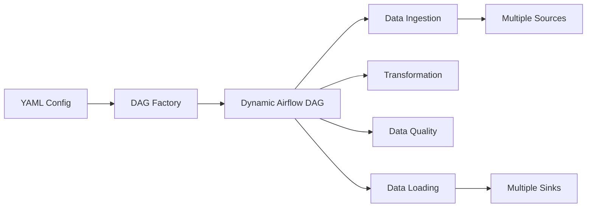
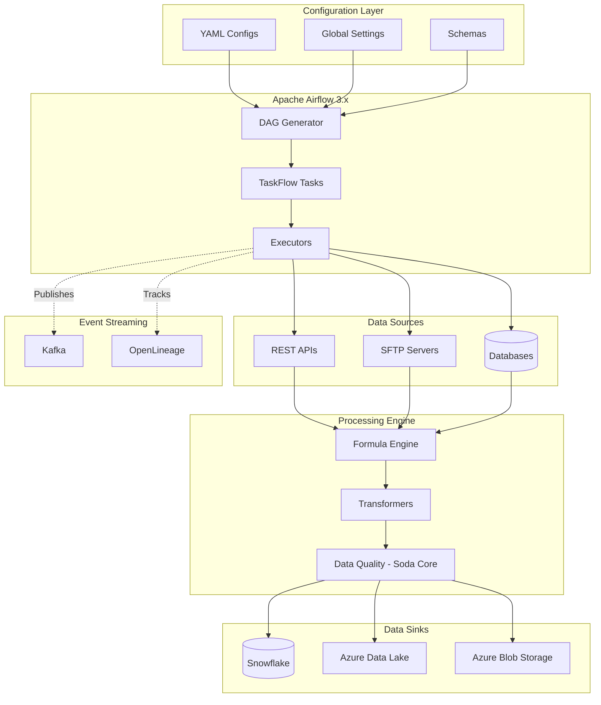
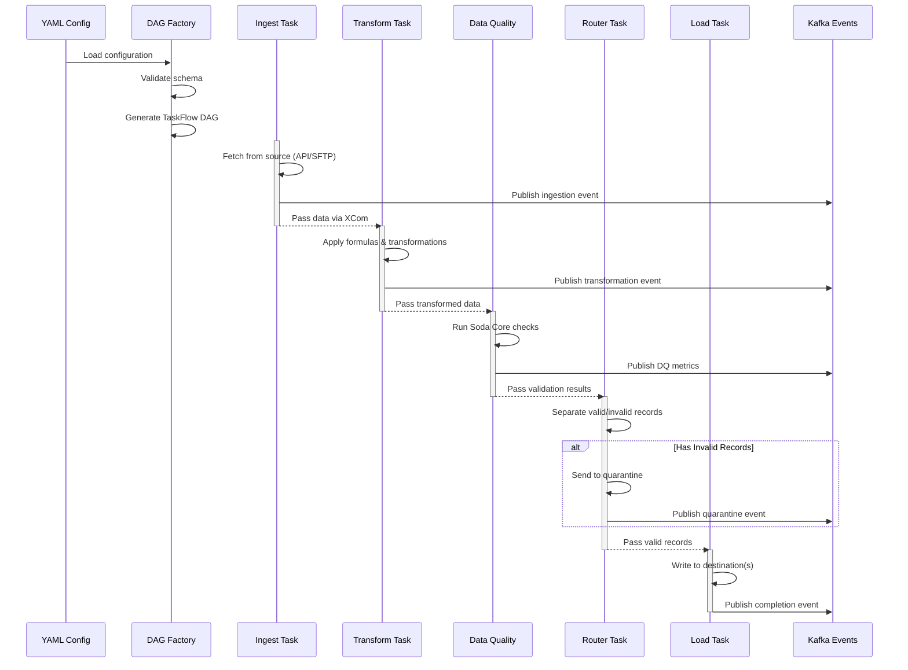
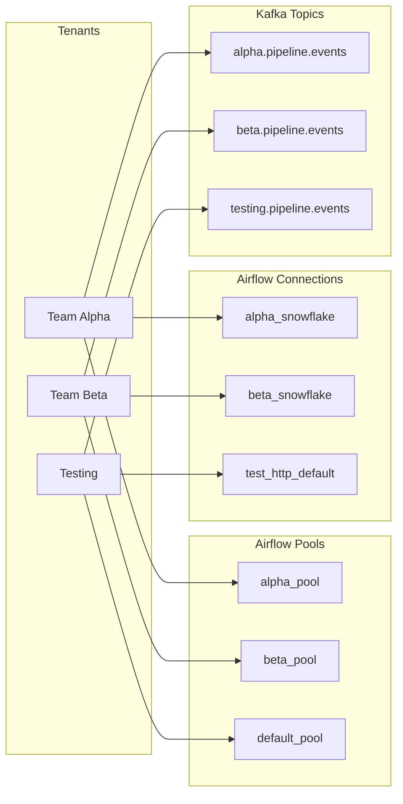

# Royal Flow: Configuration Driven Data Pipeline - Overview

## Table of Contents
- [Introduction](#introduction)
- [What is Configuration Driven Pipeline?](#what-is-configuration-driven-pipeline)
- [History and Motivation](#history-and-motivation)
- [Key Features](#key-features)
- [Architecture](#architecture)
  - [High-Level Architecture](#high-level-architecture)
  - [Pipeline Execution Flow](#pipeline-execution-flow)
  - [Multi-Tenancy Model](#multi-tenancy-model)
- [Core Components](#core-components)
- [Technology Stack](#technology-stack)
- [Getting Started](#getting-started)
- [Quick Start Example](#quick-start-example)

---

## Introduction

The **Royal Flow (aka Configuration Driven Data Pipeline)** is a unified, YAML-based data ingestion and transformation platform built on Apache Airflow 3.x. It eliminates the need for hardcoded ETL pipelines by dynamically generating data workflows from simple configuration files.

This approach allows data engineers and analysts to:
- **Build data pipelines without writing code** - just configure YAML files
- **Version control all pipeline definitions** through Git
- **Reuse a single platform architecture** for all data sources
- **Reduce infrastructure costs** significantly compared to traditional tools like Azure Data Factory

---

## What is Configuration Driven Pipeline?

A configuration-driven pipeline is a data engineering paradigm where:

1. **Pipeline logic is declared**, not coded
2. **YAML files define** what data to fetch, how to transform it, and where to store it
3. **A generic engine** reads these configurations and dynamically creates Airflow DAGs
4. **No custom code** is needed for most common data integration patterns



---

## History and Motivation

### The Problem
Our organization was spending significant resources on:
- **Azure Data Factory licensing costs** for numerous pipelines
- **Manual configuration time** for each new data source
- **Repetitive development work** - each pipeline required custom implementation
- **Version control challenges** with ADF's UI-based configuration

### The Solution
Born from a **Hackathon project**, this platform was designed to:
- **Reduce costs** by replacing expensive cloud tools with open-source Airflow
- **Accelerate delivery** - new pipelines in minutes instead of days
- **Improve reliability** through tested, reusable components
- **Enable GitOps** - all configurations tracked in version control

### Results
- **80%+ cost reduction** compared to Azure Data Factory
- **10x faster** pipeline development time
- **Single platform** supporting 50+ different data sources
- **Zero-code** approach accessible to non-developers

---

## Key Features

### ✅ Configuration-Driven
- **No coding required** for standard data integration patterns
- **YAML-based** pipeline definitions
- **Schema validation** ensures configuration correctness

### ✅ Multi-Source Support
- **REST APIs** with multiple authentication methods (OAuth, Bearer Token, API Key)
- **SFTP** servers with SSH key authentication
- **Database connectors** (planned)

### ✅ Advanced Transformations
- **Formula Engine** with 50+ built-in functions
- **Column derivations, filters, aggregations**
- **Safe evaluation** - sandboxed execution prevents code injection

### ✅ Data Quality Built-In
- **Soda Core integration** for validation rules
- **Quarantine invalid records** automatically
- **Human-in-the-Loop (HITL)** approval workflows for data exceptions

### ✅ Multi-Tenancy
- **Tenant isolation** for teams and projects
- **Resource pooling** by tenant
- **Namespace-based Kafka topics**

### ✅ Event-Driven Architecture
- **Kafka integration** for real-time event streaming
- **Lineage tracking** with OpenLineage support
- **Platform and custom events** published automatically

### ✅ Enterprise-Grade
- **Backfill support** for historical data loads
- **Timezone-aware scheduling**
- **Deadline alerts** with configurable callbacks
- **Circuit breaker patterns** for resilience

---

## Architecture

### High-Level Architecture



### Pipeline Execution Flow



### Multi-Tenancy Model



---

## Core Components

### 1. **Config Loader**
- Loads and validates YAML configurations
- Merges global defaults with pipeline-specific settings
- Schema validation using configuration schemas

### 2. **DAG Factory V2**
- Generates Apache Airflow DAGs dynamically using `@dag` decorator
- Creates TaskFlow API tasks with automatic XCom passing
- Implements HITL approval workflows
- Configures deadline alerts and SLAs

### 3. **Data Fetchers**
- Secure HTTP/REST API client with retry logic
- SFTP client with SSH key verification
- Connection pooling and circuit breaker patterns

### 4. **Formula Engine**
- Safe, sandboxed formula evaluation
- 50+ built-in functions (math, string, date, conditional)
- Column derivation and calculated fields
- DoS protection with timeout and nesting limits

### 5. **Data Quality Checker**
- Soda Core integration for validation rules
- Quality gates (warn/fail thresholds)
- Automatic quarantine routing
- DQ metrics publishing to Kafka

### 6. **Data Loaders**
- Multi-destination support (Snowflake, Azure, local files)
- Transactional operations with retry logic
- Batch processing for large datasets
- Tenant-aware connection resolution

### 7. **Kafka Publisher**
- Thread-safe singleton producer
- Circuit breaker for resilience
- Event namespacing by tenant
- Structured event schemas

---

## Technology Stack

| Component | Technology | Version |
|-----------|-----------|---------|
| **Orchestration** | Apache Airflow | 3.1.6 |
| **Language** | Python | 3.12 |
| **Data Quality** | Soda Core | Latest |
| **Event Streaming** | Kafka (KRaft mode) | 4.x |
| **Data Warehouse** | Snowflake | Latest |
| **Cloud Storage** | Azure Data Lake, Blob Storage | Latest |
| **Container Runtime** | Docker | 24.x |
| **Package Management** | Poetry / pip | Latest |
| **Testing** | pytest | Latest |

---

## Getting Started

### Prerequisites
- Python 3.12
- Docker Desktop
- WSL 2 (Windows) or Linux/macOS
- Git

### Quick Installation

```bash
# Clone repository
git clone <repository-url>
cd ConfigDrivenDataPipeline

# Install dependencies
pip install -r requirements.txt

# Start local Airflow (Docker)
docker-compose -f docker/docker-compose.yaml up -d

# Access Airflow UI
# http://localhost:8080
# Username: airflow
# Password: airflow
```

For detailed setup instructions, see the [Developer Guide](09_Developer_Guide.md).

---

## Quick Start Example

Here's a simple configuration that fetches data from a REST API:

```yaml
# config/data_sources/my_api_pipeline.yaml
name: my_api_pipeline
description: Fetch jokes from public API

metadata:
  tenant: testing
  owner: data-engineering

schedule:
  interval: "0 10 * * *"  # Daily at 10:00 AM
  start_date: "2024-01-01"
  catchup: false

data_source:
  name: joke_api
  type: rest_api
  endpoint: https://official-joke-api.appspot.com/random_joke
  method: GET
  response_format: json

transformations:
  - type: add_column
    column_name: processed_at
    formula: "NOW()"

destination:
  type: local_file
  path: /tmp/airflow_output/jokes.json
```

**That's it!** This configuration automatically:
1. ✅ Creates an Airflow DAG
2. ✅ Schedules daily execution
3. ✅ Fetches data from the API
4. ✅ Adds a timestamp column
5. ✅ Saves results to a file

---

## Next Steps

- **[Configuration Schemas](02_Configuration_Schemas.md)** - Learn about schema validation and global settings
- **[Data Sources](03_Data_Sources.md)** - Configure REST APIs and SFTP connections
- **[Transformations](04_Transformations_And_Enrichments.md)** - Use the Formula Engine
- **[Data Quality](05_Data_Quality_And_Validation.md)** - Set up validation rules
- **[Developer Guide](09_Developer_Guide.md)** - Development and deployment

---

**Built with ❤️ by the RLAM Developers**
