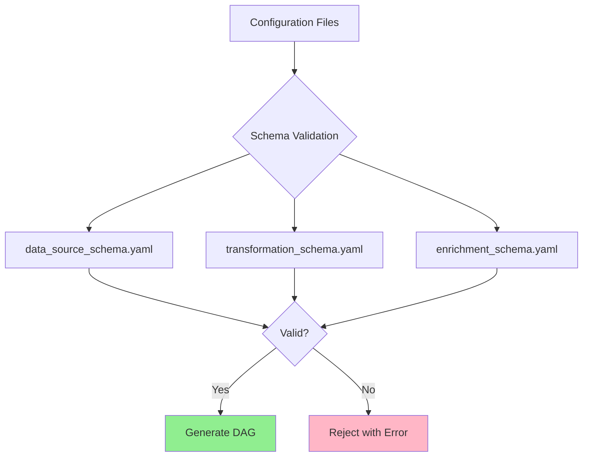
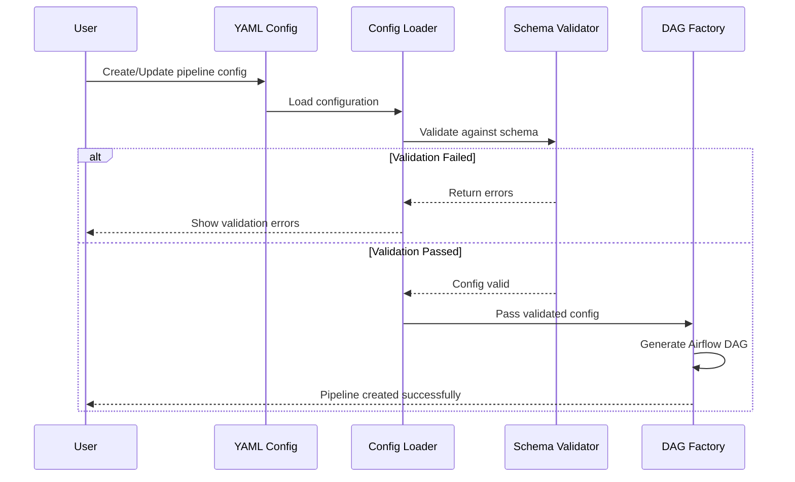
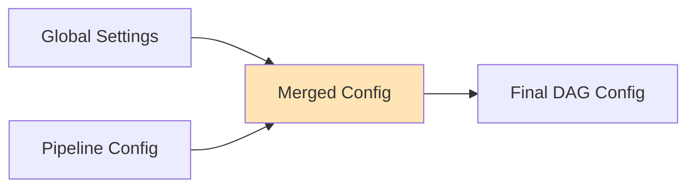

# Configuration Schemas and Validation

## Table of Contents
- [Introduction](#introduction)
- [Schema Overview](#schema-overview)
- [Schema Validation Flow](#schema-validation-flow)
- [Data Source Schema](#data-source-schema)
  - [Required Fields](#required-fields)
  - [Optional Fields](#optional-fields)
  - [Field Reference Table](#field-reference-table)
- [Transformation Schema](#transformation-schema)
- [Enrichment Schema](#enrichment-schema)
- [Metadata Section](#metadata-section)
  - [Multi-Tenancy with Metadata](#multi-tenancy-with-metadata)
  - [Namespace Usage](#namespace-usage)
- [Global Settings](#global-settings)
  - [Default Values](#default-values)
  - [Tenant Configuration](#tenant-configuration)
  - [Timeout Configuration](#timeout-configuration)
- [Validation Configuration](#validation-configuration)
- [Best Practices](#best-practices)

---

## Introduction

Configuration schemas define the **structure, rules, and validation logic** for all YAML configuration files in the pipeline. They ensure that:

- ✅ All required fields are present
- ✅ Data types are correct
- ✅ Values are within allowed ranges
- ✅ Multi-tenancy constraints are enforced
- ✅ Pipelines are valid before execution

Think of schemas as **contracts** - they guarantee that configurations meet expectations before being processed by the DAG factory.

---

## Schema Overview

The platform uses three primary schema files:



| Schema File | Purpose | Validates |
|------------|---------|-----------|
| `data_source_schema.yaml` | Defines source connection rules | API endpoints, SFTP paths, authentication |
| `transformation_schema.yaml` | Defines transformation rules | Formulas, column types, filters, aggregations |
| `enrichment_schema.yaml` | Defines enrichment rules | Joins, lookups, derived fields |

---

## Schema Validation Flow



---

## Data Source Schema

The data source schema (`data_source_schema.yaml`) defines how to connect to external systems.

### Required Fields

Every pipeline configuration **must** include:

```yaml
required_fields:
  - metadata      # Tenant ownership (NEW in multi-tenancy)
  - data_source   # Source connection details
  - destination   # Where to write data
```

### Metadata Section (Required)

```yaml
metadata:
  required_fields:
    - tenant      # MUST match a tenant in global_settings.yaml
  optional_fields:
    - owner       # Override default tenant owner
    - description # Pipeline description
    - labels      # Custom key-value tags
```

**Example:**
```yaml
metadata:
  tenant: testing
  owner: data-engineering
  description: Daily API sync for customer data
  labels:
    team: analytics
    priority: high
```

### Data Source Configuration

```yaml
data_source:
  required_fields:
    - name        # Unique identifier for this source
    - type        # Source type: rest_api, sftp
    - endpoint    # For rest_api: URL endpoint
  
  allowed_types:
    - rest_api
    - sftp
  
  optional_fields:
    - connection_id    # Airflow connection ID
    - remote_path      # SFTP remote directory
    - file_pattern     # File matching pattern
    - file_format      # csv, json, parquet, xml
    - processing_mode  # single, batch
    - authentication   # Auth configuration
    - request_config   # HTTP request settings
```

### Authentication Schema

```yaml
authentication:
  allowed_types:
    - oauth           # OAuth 2.0 flow
    - bearer_token    # Static bearer token
    - api_key         # API key in header/query
    - none            # No authentication
  
  optional_fields:
    - credentials     # Secret reference
    - token_url       # OAuth token endpoint
    - client_id       # OAuth client ID
    - client_secret   # OAuth client secret
```

### Destination Schema

```yaml
destination:
  required_fields:
    - primary         # Primary destination (required)
  
  optional_fields:
    - backup          # Backup destination
    - archive         # Archive/long-term storage
    - secondary       # Secondary destination
    - summary         # Summary/aggregate destination
    - post_processing # Post-load processing
    - quarantine      # Invalid records destination
```

**Destination Types Explained:**

| Type | Purpose | Example Use Case |
|------|---------|------------------|
| `primary` | Main destination for valid data | Snowflake production table |
| `backup` | Redundant copy for disaster recovery | Azure Blob backup container |
| `archive` | Long-term storage (compressed) | Data Lake archive partition |
| `secondary` | Additional processing destination | Reporting database |
| `summary` | Aggregated/summarized data | Summary statistics table |
| `quarantine` | Invalid records from DQ checks | Quarantine table with HITL |

### Field Reference Table

#### Data Source Fields

| Field | Type | Required | Description | Example |
|-------|------|----------|-------------|---------|
| `name` | string | Yes | Unique data source identifier | `customer_api` |
| `type` | enum | Yes | Source type | `rest_api`, `sftp` |
| `endpoint` | string | Yes (REST API) | API endpoint URL | `https://api.example.com/v1/users` |
| `method` | enum | No | HTTP method | `GET`, `POST`, `PUT` |
| `connection_id` | string | No | Airflow connection ID | `http_default` |
| `remote_path` | string | Yes (SFTP) | SFTP remote path | `/data/exports` |
| `file_pattern` | string | No | File matching regex | `customer_*.csv` |
| `file_format` | enum | No | File format | `json`, `csv`, `parquet`, `xml` |
| `response_format` | enum | No | API response format | `json`, `xml` |
| `authentication` | object | No | Auth configuration | See authentication schema |
| `headers` | object | No | Custom HTTP headers | `{"X-API-Version": "2"}` |
| `timeout` | integer | No | Request timeout (seconds) | `30` |

#### Optional Fields

| Field | Type | Required | Description | Default |
|-------|------|----------|-------------|---------|
| `description` | string | No | Human-readable description | Empty |
| `schedule` | object | No | Cron schedule configuration | No schedule |
| `retries` | integer | No | Number of retry attempts | `3` |
| `retry_delay` | integer | No | Delay between retries (min) | `5` |
| `pool` | string | No | Airflow pool name | Tenant default pool |
| `tags` | array | No | DAG tags for filtering | `[]` |

---

## Transformation Schema

Defines rules for data transformations.

```yaml
transformation:
  optional_fields:
    - column_types    # Type casting
    - new_columns     # Derived columns with formulas
    - filters         # Row filtering
    - aggregations    # Group by and aggregations
    - joins           # Join with other datasets
    - custom_transform # Custom transformation logic
```

### Column Types

```yaml
column_types:
  allowed_types:
    - string
    - int
    - float
    - datetime
    - boolean
```

**Example:**
```yaml
transformations:
  column_types:
    customer_id: string
    order_amount: float
    order_date: datetime
    is_active: boolean
```

### New Columns (Formula-Based)

Use the Formula Engine to create derived columns:

```yaml
transformations:
  new_columns:
    full_name: "CONCAT(first_name, ' ', last_name)"
    total_with_tax: "order_amount * 1.13"
    processed_date: "NOW()"
    is_premium: "IF(order_amount > 1000, 'Yes', 'No')"
```

See [Transformations and Enrichments](04_Transformations_And_Enrichments.md) for formula syntax.

---

## Enrichment Schema

Enrichments add data from external sources or lookups.

```yaml
enrichment:
  optional_fields:
    - lookups         # Static lookup tables
    - joins           # Join with other datasets
    - api_enrichment  # Enrich from external API
```

**Example:**
```yaml
enrichments:
  lookups:
    - name: country_codes
      source: config/lookups/countries.csv
      join_key: country_code
      fields:
        - country_name
        - region
```

---

## Metadata Section

### Multi-Tenancy with Metadata

**Every pipeline MUST specify a tenant** for resource isolation:

```mermaid
flowchart LR
    subgraph Pipeline Config
        M[metadata.tenant]
    end
    
    subgraph Global Settings
        T[tenants.{tenant}]
    end
    
    subgraph Resources
        P[Pool Assignment]
        C[Connection Prefix]
        K[Kafka Namespace]
    end
    
    M --> T
    T --> P
    T --> C
    T --> K
```

**Configuration:**
```yaml
# In global_settings.yaml
tenants:
  testing:
    pool: default_pool
    connection_prefix: test_
    owner: data-engineering
  
  production:
    pool: production_pool
    connection_prefix: prod_
    owner: data-platform
```

```yaml
# In pipeline config
metadata:
  tenant: testing  # Must match a tenant in global_settings
```

### Namespace Usage

Tenants create namespaces for:

1. **Airflow Pools** - Resource isolation
   ```
   testing → default_pool
   production → production_pool
   ```

2. **Connection IDs** - Prefix for connections
   ```
   testing → test_snowflake, test_http_default
   production → prod_snowflake, prod_http_default
   ```

3. **Kafka Topics** - Event namespacing
   ```
   testing.pipeline.events
   production.pipeline.events
   ```

---

## Global Settings

The `global_settings.yaml` file provides platform-wide defaults.

### Structure

```yaml
# config/global_settings.yaml
default_args:
  owner: airflow
  depends_on_past: false
  email_on_failure: false
  email_on_retry: false
  retry_delay_minutes: 5

tenants:
  testing:
    pool: default_pool
    connection_prefix: test_
  development:
    pool: default_pool
    connection_prefix: dev_
  production:
    pool: production_pool
    connection_prefix: prod_

kafka:
  enabled: true
  bootstrap_servers: kafka:9092
  security_protocol: PLAINTEXT

timeouts:
  http:
    request: 30          # HTTP request timeout (seconds)
    max_retries: 3       # Maximum retry attempts
    retry_backoff: 1.0   # Backoff factor
  
  sftp:
    connect: 30          # SFTP connection timeout
    banner: 30           # Banner timeout
    auth: 30             # Authentication timeout
  
  formula:
    evaluation: 5.0      # Formula evaluation timeout
    max_length: 10240    # Maximum formula length
  
  kafka:
    request: 30          # Kafka request timeout
    flush: 10            # Flush timeout
```

### Default Values

Global defaults are merged with pipeline-specific configurations:



**Priority:** Pipeline-specific values **override** global defaults.

---

## Validation Configuration

Data quality validation rules can be defined:

```yaml
# config/validation_config.yaml
validation:
  soda_checks:
    enabled: true
    rules:
      - name: id_not_null
        column: id
        type: not_null
      
      - name: email_format
        column: email
        type: regex
        pattern: '^[a-zA-Z0-9._%+-]+@[a-zA-Z0-9.-]+\.[a-zA-Z]{2,}$'
  
  quality_gates:
    fail_threshold: 0.95   # Fail if < 95% pass rate
    warn_threshold: 0.98   # Warn if < 98% pass rate
```

See [Data Quality and Validation](05_Data_Quality_And_Validation.md) for details.

---

## Best Practices

### ✅ DO

1. **Always specify a tenant** in metadata
   ```yaml
   metadata:
     tenant: production  # Required!
   ```

2. **Use descriptive names**
   ```yaml
   data_source:
     name: customer_api_daily_sync  # Clear and specific
   ```

3. **Add descriptions and labels**
   ```yaml
   metadata:
     description: Syncs customer data from CRM API
     labels:
       domain: customer
       criticality: high
   ```

4. **Leverage global defaults** - Don't repeat common settings

5. **Version control all configs** - Use Git for tracking changes

### ❌ DON'T

1. **Don't hardcode credentials** - Use Airflow connections/secrets
   ```yaml
   # ❌ BAD
   authentication:
     api_key: "hardcoded-secret-key"
   
   # ✅ GOOD
   authentication:
     credentials: "{{ conn.api_credentials.password }}"
   ```

2. **Don't skip tenant specification**
   ```yaml
   # ❌ Missing tenant - will fail validation
   metadata:
     owner: team-alpha
   ```

3. **Don't use overly complex formulas** - Keep formulas readable
   ```yaml
   # ❌ Hard to maintain
   formula: "IF(AND(field1 > 100, OR(field2 == 'A', field3 != NULL)), UPPER(field4), LOWER(field5))"
   
   # ✅ Break into multiple steps
   formulas:
     is_eligible: "field1 > 100 AND (field2 == 'A' OR field3 != NULL)"
     normalized_value: "IF(is_eligible, UPPER(field4), LOWER(field5))"
   ```

---

## Next Steps

- **[Data Sources](03_Data_Sources.md)** - Learn how to configure REST APIs and SFTP
- **[Transformations](04_Transformations_And_Enrichments.md)** - Master the Formula Engine
- **[Data Quality](05_Data_Quality_And_Validation.md)** - Set up validation rules

---

**Questions?** Check the [Developer Guide](09_Developer_Guide.md) or reach out to the Data Engineering team.
