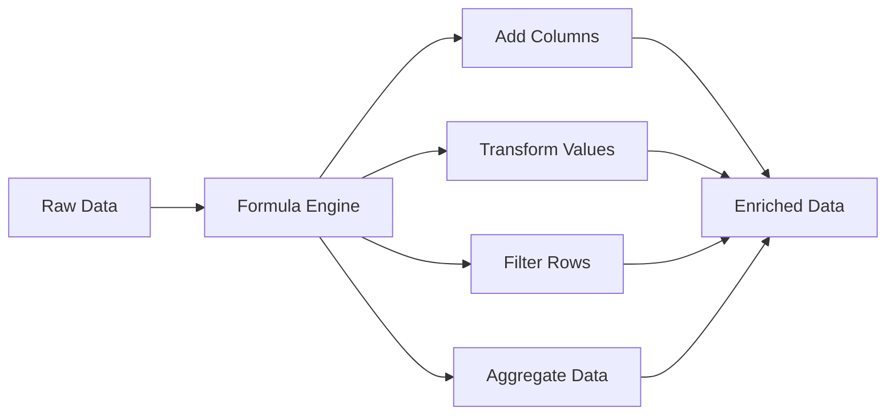
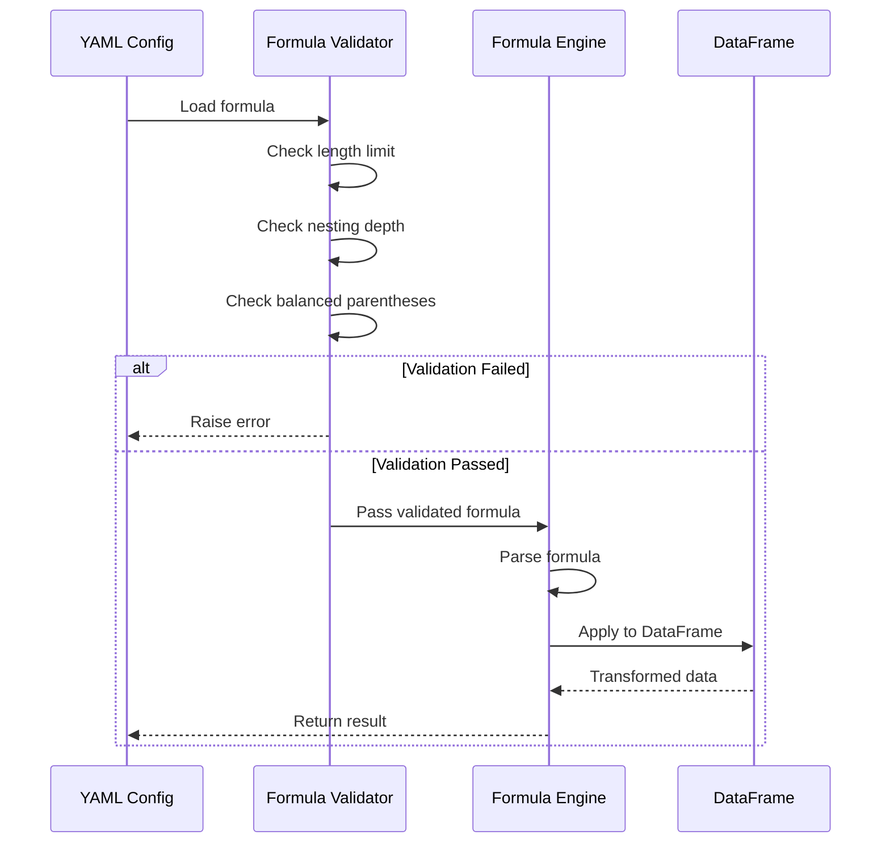
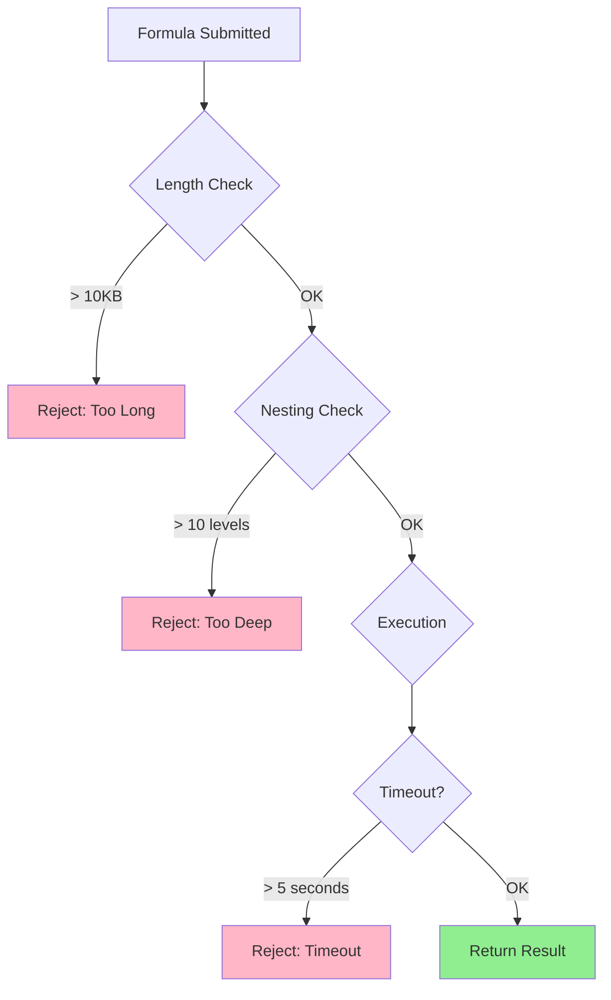

# Transformations and Enrichments

## Table of Contents
- [Introduction](#introduction)
- [Formula Engine Overview](#formula-engine-overview)
- [Available Functions](#available-functions)
  - [Math Functions](#math-functions)
  - [String Functions](#string-functions)
  - [Date and Time Functions](#date-and-time-functions)
  - [Conditional Functions](#conditional-functions)
  - [Null Handling Functions](#null-handling-functions)
  - [Type Conversion Functions](#type-conversion-functions)
- [Transformation Types](#transformation-types)
  - [Add Column](#add-column)
  - [Column Type Casting](#column-type-casting)
  - [Filters](#filters)
  - [Aggregations](#aggregations)
- [Formula Syntax and Examples](#formula-syntax-and-examples)
- [Security and Performance](#security-and-performance)
- [Advanced Use Cases](#advanced-use-cases)
- [Troubleshooting](#troubleshooting)

---

## Introduction

The **Formula Engine** is a powerful, secure, and sandboxed evaluation environment that allows you to transform data using **formula expressions** defined in YAML configurations. No Python coding required!



### Key Features

- ✅ **50+ Built-in Functions** - Math, string, date, conditional operations
- ✅ **Safe Execution** - Sandboxed environment prevents code injection
- ✅ **DoS Protection** - Timeout limits, nesting depth checks, length restrictions
- ✅ **Vectorized Performance** - Efficient pandas-based evaluation
- ✅ **Easy Syntax** - Familiar Excel-like formulas

---

## Formula Engine Overview

### How It Works



### Security Features

| Protection | Limit | Purpose |
|-----------|-------|---------|
| **Formula Length** | 10,240 characters | Prevent excessive memory usage |
| **Nesting Depth** | 10 levels | Prevent stack overflow |
| **Execution Timeout** | 5 seconds | Prevent infinite loops |
| **Whitelisted Functions** | 50+ functions | Prevent arbitrary code execution |

### Configuration

Override defaults via environment variables:

```bash
export FORMULA_MAX_LENGTH=20480
export FORMULA_MAX_NESTING=15
export FORMULA_TIMEOUT=10.0
```

---

## Available Functions

### Math Functions

| Function | Description | Example | Result |
|----------|-------------|---------|--------|
| `abs(value)` | Absolute value | `abs(-10)` | `10` |
| `round(value, decimals)` | Round to decimals | `round(3.14159, 2)` | `3.14` |
| `min(a, b, ...)` | Minimum value | `min(10, 20, 5)` | `5` |
| `max(a, b, ...)` | Maximum value | `max(10, 20, 5)` | `20` |
| `pow(base, exp)` | Power/exponent | `pow(2, 3)` | `8` |
| `sum(values)` | Sum of values | `sum([1, 2, 3])` | `6` |
| `safe_divide(a, b)` | Division with null on zero | `safe_divide(10, 0)` | `null` |

**Examples:**
```yaml
transformations:
  - type: add_column
    column_name: total
    formula: "price * quantity"
  
  - type: add_column
    column_name: discount_rate
    formula: "safe_divide(discount, price)"
  
  - type: add_column
    column_name: max_value
    formula: "max(value1, value2, value3)"
```

### String Functions

| Function | Description | Example | Result |
|----------|-------------|---------|--------|
| `upper(string)` | Convert to uppercase | `upper('hello')` | `'HELLO'` |
| `lower(string)` | Convert to lowercase | `lower('WORLD')` | `'world'` |
| `strip(string)` | Remove whitespace | `strip('  text  ')` | `'text'` |
| `trim(string)` | Alias for strip | `trim('  text  ')` | `'text'` |
| `left(string, n)` | First n characters | `left('hello', 2)` | `'he'` |
| `right(string, n)` | Last n characters | `right('hello', 2)` | `'lo'` |
| `substring(s, start, end)` | Extract substring | `substring('hello', 1, 4)` | `'ell'` |
| `concat(s1, s2, ...)` | Concatenate strings | `concat('hello', ' ', 'world')` | `'hello world'` |
| `replace(s, old, new)` | Replace substring | `replace('hello', 'l', 'r')` | `'herro'` |
| `split(string, sep)` | Split string | `split('a,b,c', ',')` | `['a', 'b', 'c']` |
| `contains(s, sub)` | Check if contains | `contains('hello', 'ell')` | `true` |
| `starts_with(s, prefix)` | Check prefix | `starts_with('hello', 'he')` | `true` |
| `ends_with(s, suffix)` | Check suffix | `ends_with('hello', 'lo')` | `true` |
| `length(string)` | String length | `length('hello')` | `5` |

**Examples:**
```yaml
transformations:
  - type: add_column
    column_name: full_name
    formula: "concat(first_name, ' ', last_name)"
  
  - type: add_column
    column_name: email_domain
    formula: "split(email, '@')[1]"
  
  - type: add_column
    column_name: product_code
    formula: "upper(left(product_name, 3))"
```

### Date and Time Functions

| Function | Description | Example | Result |
|----------|-------------|---------|--------|
| `now()` | Current datetime | `now()` | `2024-02-04 10:30:00` |
| `today()` | Current date | `today()` | `2024-02-04` |
| `year(date)` | Extract year | `year('2024-02-04')` | `2024` |
| `month(date)` | Extract month | `month('2024-02-04')` | `2` |
| `day(date)` | Extract day | `day('2024-02-04')` | `4` |
| `hour(datetime)` | Extract hour | `hour('2024-02-04 10:30')` | `10` |
| `minute(datetime)` | Extract minute | `minute('2024-02-04 10:30')` | `30` |
| `date_diff(d1, d2, unit)` | Date difference | `date_diff('2024-02-04', '2024-01-01', 'days')` | `34` |
| `format_date(d, fmt)` | Format date | `format_date('2024-02-04', '%d/%m/%Y')` | `'04/02/2024'` |
| `parse_date(s, fmt)` | Parse date string | `parse_date('04/02/2024', '%d/%m/%Y')` | `2024-02-04` |

**Units for date_diff:**
- `'days'` - Day difference
- `'hours'` - Hour difference
- `'minutes'` - Minute difference
- `'seconds'` - Second difference

**Examples:**
```yaml
transformations:
  - type: add_column
    column_name: processed_at
    formula: "now()"
  
  - type: add_column
    column_name: order_year
    formula: "year(order_date)"
  
  - type: add_column
    column_name: days_since_order
    formula: "date_diff(today(), order_date, 'days')"
  
  - type: add_column
    column_name: formatted_date
    formula: "format_date(order_date, '%Y-%m-%d')"
```

### Conditional Functions

| Function | Description | Example | Result |
|----------|-------------|---------|--------|
| `if_else(cond, true, false)` | If-then-else | `if_else(age >= 18, 'Adult', 'Minor')` | `'Adult'` or `'Minor'` |
| `case_when(c1, v1, c2, v2, default)` | SQL CASE | `case_when(score >= 90, 'A', score >= 80, 'B', 'C')` | Grade |
| `between(val, low, high)` | Range check | `between(age, 18, 65)` | `true` or `false` |
| `in_list(val, list)` | Check membership | `in_list(status, ['active', 'pending'])` | `true` or `false` |

**Examples:**
```yaml
transformations:
  - type: add_column
    column_name: age_group
    formula: "if_else(age >= 18, 'Adult', 'Child')"
  
  - type: add_column
    column_name: priority
    formula: "case_when(amount > 10000, 'High', amount > 1000, 'Medium', 'Low')"
  
  - type: add_column
    column_name: is_weekend
    formula: "in_list(day_of_week, ['Saturday', 'Sunday'])"
```

### Null Handling Functions

| Function | Description | Example | Result |
|----------|-------------|---------|--------|
| `coalesce(v1, v2, ...)` | First non-null value | `coalesce(null, null, 'default')` | `'default'` |
| `ifnull(val, default)` | Replace null | `ifnull(discount, 0)` | `discount` or `0` |
| `nullif(val, compare)` | Null if equal | `nullif(status, 'unknown')` | `null` if status is 'unknown' |
| `is_null(val)` | Check if null | `is_null(phone)` | `true` or `false` |
| `is_not_null(val)` | Check if not null | `is_not_null(email)` | `true` or `false` |

**Examples:**
```yaml
transformations:
  - type: add_column
    column_name: display_name
    formula: "coalesce(nickname, first_name, 'Anonymous')"
  
  - type: add_column
    column_name: final_price
    formula: "price - ifnull(discount, 0)"
```

### Type Conversion Functions

| Function | Description | Example | Result |
|----------|-------------|---------|--------|
| `to_string(val)` | Convert to string | `to_string(123)` | `'123'` |
| `to_int(val)` | Convert to integer | `to_int('123')` | `123` |
| `to_float(val)` | Convert to float | `to_float('3.14')` | `3.14` |
| `to_bool(val)` | Convert to boolean | `to_bool(1)` | `true` |
| `to_date(val, fmt)` | Convert to date | `to_date('2024-02-04')` | `2024-02-04` |

**Examples:**
```yaml
transformations:
  - type: add_column
    column_name: id_string
    formula: "to_string(customer_id)"
  
  - type: add_column
    column_name: quantity_int
    formula: "to_int(quantity_text)"
```

---

## Transformation Types

### Add Column

Create new columns with derived values:

```yaml
transformations:
  - type: add_column
    column_name: total_amount
    formula: "price * quantity"
  
  - type: add_column
    column_name: full_address
    formula: "concat(street, ', ', city, ', ', postal_code)"
  
  - type: add_column
    column_name: is_premium
    formula: "if_else(customer_tier == 'Gold', true, false)"
```

**Multiple Columns Example:**
```yaml
transformations:
  - type: add_column
    column_name: subtotal
    formula: "price * quantity"
  
  - type: add_column
    column_name: tax
    formula: "subtotal * 0.13"
  
  - type: add_column
    column_name: total
    formula: "subtotal + tax"
```

### Column Type Casting

Convert column data types:

```yaml
transformations:
  column_types:
    customer_id: string
    order_amount: float
    order_date: datetime
    is_active: boolean
    quantity: int
```

**Supported Types:**
- `string` - Text data
- `int` - Integer numbers
- `float` - Decimal numbers
- `datetime` - Date and time
- `boolean` - True/False values

### Filters

Remove rows based on conditions:

```yaml
transformations:
  filters:
    - column: status
      operator: equals
      value: "active"
    
    - column: amount
      operator: greater_than
      value: 100
    
    - column: created_date
      operator: greater_than_or_equal
      value: "2024-01-01"
```

**Supported Operators:**
- `equals` - Exact match
- `not_equals` - Not equal
- `greater_than` - `>`
- `greater_than_or_equal` - `>=`
- `less_than` - `<`
- `less_than_or_equal` - `<=`
- `contains` - String contains
- `in` - Value in list

**Example with Formula:**
```yaml
transformations:
  - type: add_column
    column_name: is_valid
    formula: "is_not_null(email) and is_not_null(phone)"
  
  filters:
    - column: is_valid
      operator: equals
      value: true
```

### Aggregations

Group and aggregate data:

```yaml
transformations:
  aggregations:
    group_by:
      - customer_id
      - order_date
    
    aggregates:
      - column: order_amount
        function: sum
        alias: total_amount
      
      - column: order_id
        function: count
        alias: order_count
      
      - column: order_amount
        function: avg
        alias: avg_amount
```

**Aggregation Functions:**
- `sum` - Sum of values
- `count` - Count of rows
- `avg` - Average value
- `min` - Minimum value
- `max` - Maximum value
- `first` - First value
- `last` - Last value

---

## Formula Syntax and Examples

### Basic Arithmetic

```yaml
# Calculate total price
formula: "unit_price * quantity"

# Apply discount
formula: "(price * quantity) * (1 - discount_rate)"

# Tax calculation
formula: "subtotal * 0.13"
```

### String Manipulation

```yaml
# Full name
formula: "concat(first_name, ' ', last_name)"

# Email username
formula: "split(email, '@')[0]"

# Uppercase product code
formula: "upper(concat(category, '-', product_id))"

# Extract area code from phone
formula: "substring(phone, 0, 3)"
```

### Date Operations

```yaml
# Add processing timestamp
formula: "now()"

# Calculate age
formula: "date_diff(today(), birth_date, 'years')"

# Extract month name
formula: "format_date(order_date, '%B')"

# Is recent order?
formula: "date_diff(today(), order_date, 'days') <= 30"
```

### Conditional Logic

```yaml
# Simple if-else
formula: "if_else(quantity > 100, 'Bulk', 'Standard')"

# Multiple conditions (case_when)
formula: "case_when(
  score >= 90, 'A',
  score >= 80, 'B',
  score >= 70, 'C',
  score >= 60, 'D',
  'F'
)"

# Complex condition
formula: "if_else(
  (amount > 1000) and (status == 'active'),
  'Premium',
  'Regular'
)"
```

### Null Handling

```yaml
# Default value for null
formula: "coalesce(discount, 0)"

# Multiple fallbacks
formula: "coalesce(mobile_phone, home_phone, work_phone, 'No phone')"

# Conditional based on null
formula: "if_else(is_null(email), 'No email', 'Has email')"
```

---

## Security and Performance

### DoS Protection

The Formula Engine includes protection against Denial-of-Service attacks:



### Performance Tips

1. **Use vectorized operations** - Formula Engine uses pandas for efficiency
   ```yaml
   # ✅ Good: Single formula
   formula: "price * quantity * (1 - discount)"
   
   # ❌ Avoid: Multiple separate steps
   formula: "step1 * step2 * step3"
   ```

2. **Avoid complex string operations on large datasets**
   ```yaml
   # ⚠️ Slow for millions of rows
   formula: "upper(concat(field1, field2, field3, field4))"
   ```

3. **Use type casting wisely**
   ```yaml
   # Cast columns in batch
   column_types:
     amount: float
     quantity: int
   
   # Then use in formulas
   formula: "amount * quantity"
   ```

4. **Filter early** - Reduce dataset size before transformations
   ```yaml
   # ✅ Good: Filter first
   filters:
     - column: status
       operator: equals
       value: "active"
   
   transformations:
     - type: add_column
       column_name: total
       formula: "price * quantity"
   ```

---

## Advanced Use Cases

### Case Study 1: E-commerce Order Processing

```yaml
transformations:
  # Calculate subtotal
  - type: add_column
    column_name: subtotal
    formula: "price * quantity"
  
  # Apply discount
  - type: add_column
    column_name: discount_amount
    formula: "subtotal * coalesce(discount_rate, 0)"
  
  # Calculate tax
  - type: add_column
    column_name: tax_amount
    formula: "(subtotal - discount_amount) * 0.13"
  
  # Final total
  - type: add_column
    column_name: total_amount
    formula: "subtotal - discount_amount + tax_amount"
  
  # Categorize order
  - type: add_column
    column_name: order_category
    formula: "case_when(
      total_amount >= 1000, 'Large',
      total_amount >= 100, 'Medium',
      'Small'
    )"
  
  # Add timestamp
  - type: add_column
    column_name: processed_at
    formula: "now()"
```

### Case Study 2: Customer Segmentation

```yaml
transformations:
  # Calculate customer lifetime value
  - type: add_column
    column_name: customer_age_days
    formula: "date_diff(today(), first_purchase_date, 'days')"
  
  # Average order value
  - type: add_column
    column_name: avg_order_value
    formula: "safe_divide(total_revenue, order_count)"
  
  # Segment customers
  - type: add_column
    column_name: customer_segment
    formula: "case_when(
      (total_revenue > 10000) and (order_count > 20), 'VIP',
      (total_revenue > 5000) and (order_count > 10), 'Gold',
      (total_revenue > 1000) and (order_count > 5), 'Silver',
      'Bronze'
    )"
  
  # Risk flag
  - type: add_column
    column_name: at_risk
    formula: "if_else(
      date_diff(today(), last_purchase_date, 'days') > 180,
      true,
      false
    )"
```

---

## Troubleshooting

### Common Errors

#### Error: Formula Too Long

**Error Message:**
```
FormulaError: Formula exceeds maximum length of 10240 characters
```

**Solution:**
- Break complex formulas into multiple steps
- Use intermediate columns

```yaml
# ❌ Too long
formula: "very_long_formula_with_many_operations..."

# ✅ Better
- type: add_column
  column_name: intermediate_step1
  formula: "calculation_part1"

- type: add_column
  column_name: final_result
  formula: "intermediate_step1 * factor"
```

#### Error: Nesting Too Deep

**Error Message:**
```
FormulaError: Formula exceeds maximum nesting depth of 10
```

**Solution:**
```yaml
# ❌ Too nested
formula: "if_else(if_else(if_else(...)))"

# ✅ Better
formula: "case_when(condition1, value1, condition2, value2, default)"
```

#### Error: Division by Zero

**Error Message:**
```
ZeroDivisionError: division by zero
```

**Solution:**
```yaml
# ❌ Can fail
formula: "revenue / orders"

# ✅ Safe
formula: "safe_divide(revenue, orders)"
```

#### Error: Column Not Found

**Error Message:**
```
KeyError: 'column_name'
```

**Solution:**
- Verify column name spelling
- Check if column exists in source data
- Ensure dependent columns are created first

---

## Next Steps

- **[Data Quality and Validation](05_Data_Quality_And_Validation.md)** - Validate transformed data
- **[Data Sinks](08_Data_Sinks.md)** - Load data to destinations
- **[Developer Guide](09_Developer_Guide.md)** - Testing transformations

---

**Pro Tip:** Test formulas incrementally! Start simple and build complexity step-by-step.
