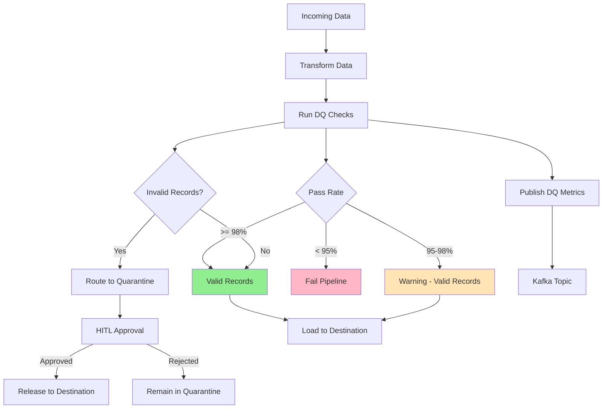
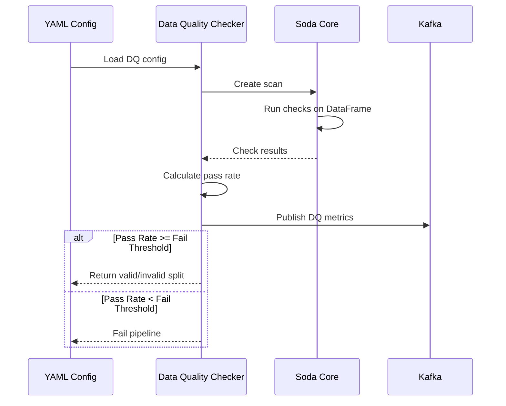
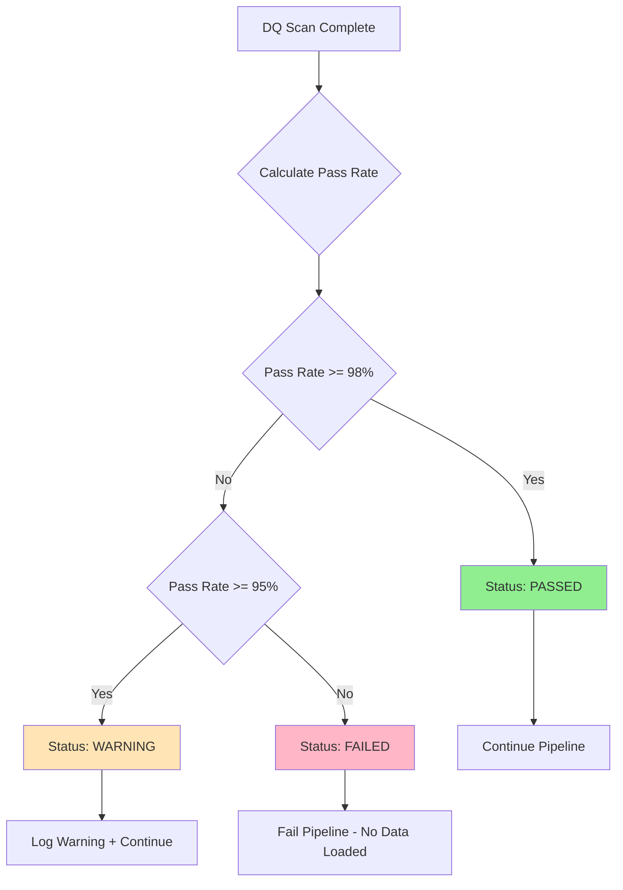
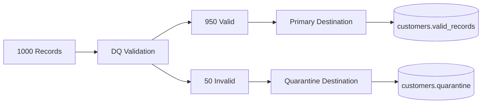
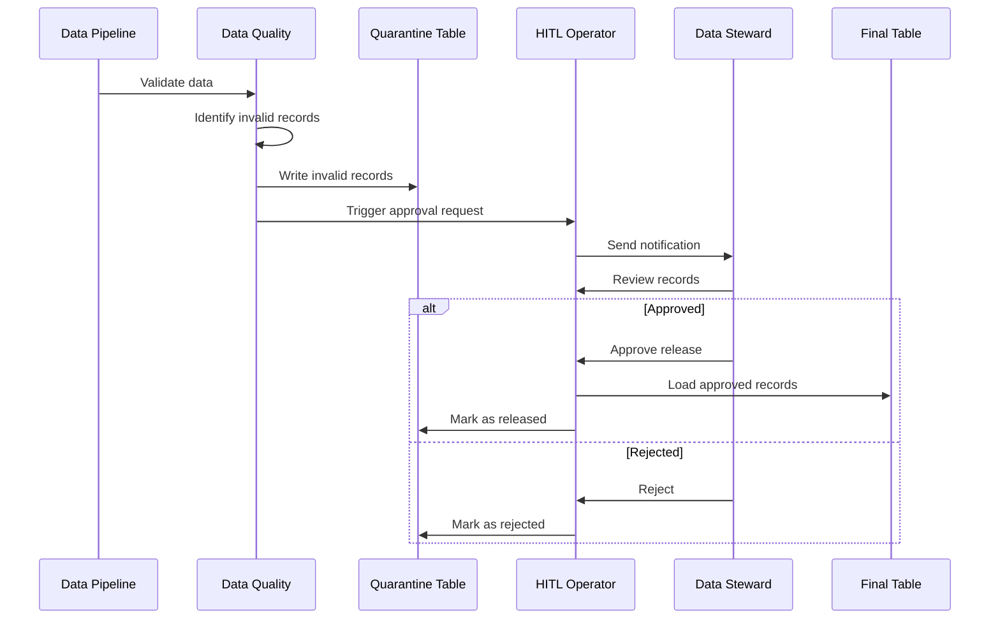

# Data Quality and Validation

## Table of Contents
- [Introduction](#introduction)
- [Soda Core Integration](#soda-core-integration)
- [Validation Rules](#validation-rules)
  - [Not Null Checks](#not-null-checks)
  - [Unique Constraints](#unique-constraints)
  - [Regex Pattern Matching](#regex-pattern-matching)
  - [Range Checks](#range-checks)
  - [Custom SQL Checks](#custom-sql-checks)
- [Quality Gates](#quality-gates)
- [Quarantine Management](#quarantine-management)
  - [Automatic Quarantine Routing](#automatic-quarantine-routing)
  - [Human-in-the-Loop (HITL) Approval](#human-in-the-loop-hitl-approval)
- [Data Quality Metrics](#data-quality-metrics)
- [Configuration Examples](#configuration-examples)
- [Best Practices](#best-practices)
- [Troubleshooting](#troubleshooting)

---

## Introduction

Data Quality (DQ) is a **first-class feature** of the Configuration Driven Pipeline. Built on **Soda Core**, the platform provides:

- ✅ **Automated validation** - Define rules in YAML, run automatically
- ✅ **Quality gates** - Set pass/fail/warn thresholds
- ✅ **Quarantine management** - Automatically route invalid records
- ✅ **HITL workflows** - Human approval for releasing quarantined data
- ✅ **DQ metrics** - Publish results to Kafka for monitoring



---

## Soda Core Integration

**Soda Core** is an open-source data quality framework that uses **SodaCL** (Soda Checks Language) to define validation rules.

### Enabling Data Quality

```yaml
data_quality_checks:
  enabled: true
  rules:
    - name: customer_id_not_null
      column: customer_id
      type: not_null
```

### How It Works



---

## Validation Rules

### Not Null Checks

Ensure critical columns have values:

```yaml
data_quality_checks:
  enabled: true
  rules:
    - name: customer_id_not_null
      column: customer_id
      type: not_null
      description: "Customer ID must be present"
    
    - name: email_not_null
      column: email
      type: not_null
```

**Behavior:**
- Rows with `null` values in the column **fail** the check
- Failed rows are routed to quarantine

### Unique Constraints

Check for duplicate values:

```yaml
data_quality_checks:
  rules:
    - name: customer_id_unique
      column: customer_id
      type: unique
      description: "Customer IDs must be unique"
```

**Behavior:**
- Duplicate values are flagged
- All duplicate rows fail the check

### Regex Pattern Matching

Validate format using regular expressions:

```yaml
data_quality_checks:
  rules:
    - name: email_format
      column: email
      type: regex
      pattern: '^[a-zA-Z0-9._%+-]+@[a-zA-Z0-9.-]+\.[a-zA-Z]{2,}$'
      description: "Email must be valid format"
    
    - name: phone_format
      column: phone
      type: regex
      pattern: '^\d{3}-\d{3}-\d{4}$'
      description: "Phone must be xxx-xxx-xxxx"
```

### Range Checks

Ensure values fall within expected ranges:

```yaml
data_quality_checks:
  rules:
    - name: age_range
      column: age
      type: range
      min: 18
      max: 120
      description: "Age must be between 18 and 120"
    
    - name: order_amount_positive
      column: order_amount
      type: range
      min: 0
      description: "Order amount must be positive"
```

### Custom SQL Checks

Write custom validation logic:

```yaml
data_quality_checks:
  rules:
    - name: total_matches_subtotal_plus_tax
      type: custom_sql
      sql: |
        SELECT *
        FROM {table}
        WHERE ABS(total - (subtotal + tax)) > 0.01
      description: "Total should equal subtotal + tax"
```

**Note:** `{table}` is replaced with the actual DataFrame/table name.

### Completeness Checks

Check for missing data across the dataset:

```yaml
data_quality_checks:
  rules:
    - name: dataset_completeness
      type: completeness
      threshold: 0.95
      description: "At least 95% of records must be complete"
```

---

## Quality Gates

Quality gates define **pass/fail/warn thresholds** based on the percentage of records passing validation.

```yaml
data_quality_checks:
  enabled: true
  
  quality_gates:
    fail_threshold: 0.95   # Fail pipeline if < 95% pass rate
    warn_threshold: 0.98   # Warn if < 98% pass rate (but continue)
  
  rules:
    - name: critical_fields_not_null
      columns:
        - customer_id
        - order_id
        - order_date
      type: not_null
```

### Quality Gate Behavior



| Pass Rate | Status | Action |
|-----------|--------|--------|
| >= 98% | ✅ PASSED | Pipeline continues normally |
| 95% - 98% | ⚠️ WARNING | Pipeline continues with warning logged |
| < 95% | ❌ FAILED | Pipeline fails, no data loaded |

---

## Quarantine Management

### Automatic Quarantine Routing

Invalid records are **automatically separated** from valid records:

```yaml
data_quality_checks:
  enabled: true
  rules:
    - name: email_not_null
      column: email
      type: not_null

destination:
  primary:
    type: snowflake
    table: customers.valid_records
  
  quarantine:
    type: snowflake
    table: customers.quarantine
    description: "Records with validation failures"
```

**Quarantine Flow:**



### Human-in-the-Loop (HITL) Approval

**HITL** enables human review and approval before releasing quarantined data.

#### Configuration

```yaml
destination:
  quarantine:
    type: snowflake
    table: customers.quarantine
    
    hitl:
      enabled: true
      approval_timeout: 86400  # 24 hours
      approvers:
        - data-quality-team@example.com
      metadata:
        team: data-engineering
        priority: high
```

#### HITL Workflow



#### Approval UI

Data stewards receive an **Airflow UI notification** to approve or reject quarantined records:

- **Review metadata**: View DQ check failures
- **Preview records**: See sample of quarantined data
- **Approve/Reject**: Make decision
- **Add notes**: Document reasoning

---

## Data Quality Metrics

DQ metrics are **automatically published to Kafka** for monitoring and alerting.

### Metrics Schema

```json
{
  "scan_id": "uuid-1234",
  "timestamp": "2024-02-04T10:30:00Z",
  "source": "customer_api",
  "destination_table": "customers.raw_data",
  "total_rows": 1000,
  "checks": [
    {
      "name": "customer_id_not_null",
      "column": "customer_id",
      "type": "not_null",
      "passed": 950,
      "failed": 50,
      "pass_rate": 0.95,
      "status": "failed"
    }
  ],
  "passed": 1,
  "failed": 1,
  "warnings": 0,
  "pass_rate": 0.95,
  "status": "warning"
}
```

### Kafka Topic

Metrics are published to:
```
{tenant}.{namespace}_dq_metrics
```

Example:
```
production.pipeline_dq_metrics
testing.pipeline_dq_metrics
```

---

## Configuration Examples

### Example 1: E-commerce Order Validation

```yaml
name: order_validation
description: Validate e-commerce orders

metadata:
  tenant: production
  owner: data-quality

data_quality_checks:
  enabled: true
  
  quality_gates:
    fail_threshold: 0.99   # 99% must pass
    warn_threshold: 0.995  # Warn if < 99.5%
  
  rules:
    # Critical fields - must not be null
    - name: order_id_not_null
      column: order_id
      type: not_null
      severity: critical
    
    - name: customer_id_not_null
      column: customer_id
      type: not_null
      severity: critical
    
    # Unique constraints
    - name: order_id_unique
      column: order_id
      type: unique
      severity: critical
    
    # Format validation
    - name: email_format
      column: customer_email
      type: regex
      pattern: '^[a-zA-Z0-9._%+-]+@[a-zA-Z0-9.-]+\.[a-zA-Z]{2,}$'
      severity: high
    
    # Range checks
    - name: order_amount_positive
      column: order_amount
      type: range
      min: 0
      severity: high
    
    - name: quantity_valid
      column: quantity
      type: range
      min: 1
      max: 10000
      severity: medium

destination:
  primary:
    type: snowflake
    table: orders.validated
  
  quarantine:
    type: snowflake
    table: orders.quarantine
    hitl:
      enabled: true
      approval_timeout: 3600  # 1 hour
```

### Example 2: Customer Data with HITL

```yaml
name: customer_import
description: Daily customer data import with DQ

data_quality_checks:
  enabled: true
  
  quality_gates:
    fail_threshold: 0.90
    warn_threshold: 0.95
  
  rules:
    - name: required_fields_not_null
      columns:
        - customer_id
        - first_name
        - last_name
        - email
      type: not_null
    
    - name: email_unique
      column: email
      type: unique
    
    - name: phone_format
      column: phone
      type: regex
      pattern: '^\+?\d{10,15}$'

destination:
  primary:
    type: snowflake
    database: PROD_DB
    schema: customers
    table: customer_master
  
  quarantine:
    type: snowflake
    database: PROD_DB
    schema: customers
    table: customer_quarantine
    
    hitl:
      enabled: true
      approval_timeout: 86400  # 24 hours
      approvers:
        - data-stewards@example.com
      metadata:
        description: "Quarantined customers require approval"
        severity: medium
```

---

## Best Practices

### ✅ DO

1. **Define quality gates** for every pipeline
   ```yaml
   quality_gates:
     fail_threshold: 0.95
     warn_threshold: 0.98
   ```

2. **Validate critical fields first**
   ```yaml
   rules:
     - name: id_not_null
       column: id
       type: not_null
       severity: critical
   ```

3. **Use appropriate severity levels**
   - `critical` - Must pass, fail immediately
   - `high` - Important, counts toward quality gate
   - `medium` - Warning level
   - `low` - Informational

4. **Enable HITL for important data**
   ```yaml
   quarantine:
     hitl:
       enabled: true
       approvers: [team@example.com]
   ```

5. **Monitor DQ metrics** via Kafka consumers

### ❌ DON'T

1. **Don't skip DQ for "simple" pipelines**
   ```yaml
   # ❌ BAD - No validation
   data_quality_checks:
     enabled: false
   ```

2. **Don't set thresholds too low**
   ```yaml
   # ❌ BAD - Allows 50% invalid data!
   quality_gates:
     fail_threshold: 0.50
   ```

3. **Don't ignore warnings**
   - Investigate warnings - they indicate data quality issues

---

## Troubleshooting

### Issue: DQ Check Always Fails

**Symptom:** All records fail a check

**Diagnosis:**
```yaml
rules:
  - name: debug_check
    column: my_column
    type: not_null
```

**Solutions:**
1. Verify column name is correct
2. Check if column exists in DataFrame
3. Review source data format

### Issue: Regex Pattern Not Matching

**Symptom:** Valid data fails regex check

**Example:**
```yaml
# ❌ Pattern too strict
pattern: '^[A-Z]{2}\d{4}$'  # Only matches: AB1234
```

**Solution:**
```yaml
# ✅ More flexible
pattern: '^[A-Za-z]{2}\d{4,6}$'  # Matches: AB1234, ab123456
```

**Pro Tip:** Test regex patterns at [regex101.com](https://regex101.com)

### Issue: HITL Approval Not Triggered

**Check:**
1. Is `hitl.enabled: true`?
2. Are there invalid records in quarantine?
3. Check Airflow logs for HITL operator

### Issue: Quality Gate Too Strict

**Error:**
```
DataQualityError: Pass rate 96.5% below fail threshold 98%
```

**Solution:**
```yaml
# Adjust thresholds based on data quality expectations
quality_gates:
  fail_threshold: 0.95  # Lowered from 0.98
  warn_threshold: 0.97  # Lowered from 0.99
```

---

## Next Steps

- **[Scheduling and Execution](06_Scheduling_And_Execution.md)** - Schedule DQ pipelines
- **[Kafka Events](07_Kafka_Events.md)** - Monitor DQ metrics
- **[Developer Guide](09_Developer_Guide.md)** - Test DQ rules locally

---

**Data Quality is Data Trust!** Always validate your data before loading to production.
