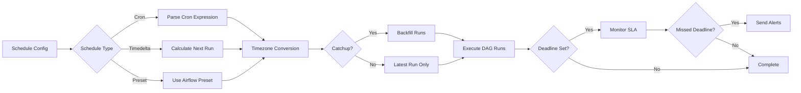
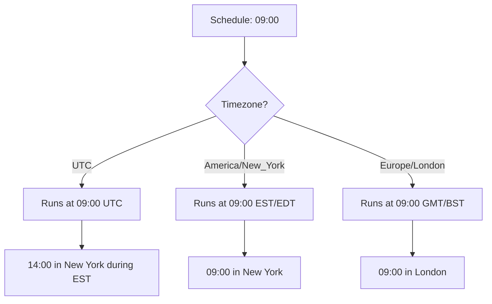
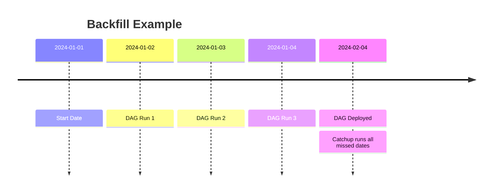
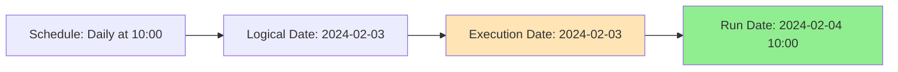
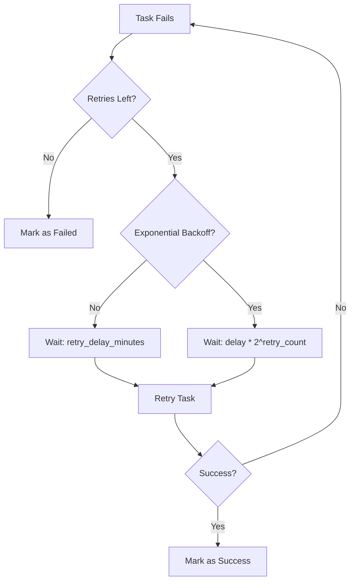

# Scheduling and Execution

## Table of Contents
- [Introduction](#introduction)
- [Schedule Configuration](#schedule-configuration)
  - [Cron Expressions](#cron-expressions)
  - [Timedelta Schedules](#timedelta-schedules)
  - [Preset Schedules](#preset-schedules)
- [Timezone Management](#timezone-management)
- [Backfills](#backfills)
  - [Historical Data Loads](#historical-data-loads)
  - [Catchup Behavior](#catchup-behavior)
- [Deadlines and SLAs](#deadlines-and-slas)
  - [Deadline Configuration](#deadline-configuration)
  - [Alert Mechanisms](#alert-mechanisms)
- [DAG Execution Context](#dag-execution-context)
- [Retry Logic](#retry-logic)
- [Pools and Concurrency](#pools-and-concurrency)
- [Complete Examples](#complete-examples)
- [Best Practices](#best-practices)

---

## Introduction

The Configuration Driven Pipeline provides **flexible scheduling** capabilities powered by Apache Airflow 3.x, including:

- ✅ **Cron-based scheduling** - Standard cron expressions
- ✅ **Timezone awareness** - Schedule in any timezone
- ✅ **Backfill support** - Load historical data automatically
- ✅ **Deadline alerts** - Get notified when DAGs miss SLAs
- ✅ **Resource pooling** - Control concurrent execution



---

## Schedule Configuration

### Cron Expressions

Standard 5-field cron format:

```
┌───────────── minute (0 - 59)
│ ┌───────────── hour (0 - 23)
│ │ ┌───────────── day of month (1 - 31)
│ │ │ ┌───────────── month (1 - 12)
│ │ │ │ ┌───────────── day of week (0 - 6) (Sunday to Saturday)
│ │ │ │ │
* * * * *
```

#### Common Cron Patterns

| Pattern | Description | Example Use Case |
|---------|-------------|------------------|
| `0 2 * * *` | Daily at 2:00 AM | Nightly batch jobs |
| `0 */4 * * *` | Every 4 hours | API sync |
| `0 9 * * 1-5` | Weekdays at 9:00 AM | Business day reports |
| `0 0 1 * *` | First day of month | Monthly aggregations |
| `*/15 * * * *` | Every 15 minutes | Near real-time sync |
| `0 0 * * 0` | Sundays at midnight | Weekly cleanup |

#### Configuration Example

```yaml
schedule:
  interval: "0 10 * * *"  # Daily at 10:00 AM
  start_date: "2024-01-01"
  end_date: "2024-12-31"  # Optional
  catchup: false
  timezone: "America/New_York"
```

### Timedelta Schedules

Use timedelta for interval-based scheduling:

```yaml
schedule:
  interval: 
    hours: 6  # Every 6 hours
  start_date: "2024-01-01"
```

**Supported Units:**
- `days: 1` - Daily
- `hours: 12` - Every 12 hours
- `minutes: 30` - Every 30 minutes
- `weeks: 1` - Weekly

**Examples:**
```yaml
# Every 6 hours
schedule:
  interval:
    hours: 6

# Every 2 days
schedule:
  interval:
    days: 2

# Every 30 minutes
schedule:
  interval:
    minutes: 30
```

### Preset Schedules

Use Airflow preset schedules:

```yaml
schedule:
  interval: "@daily"      # Equivalent to "0 0 * * *"
  start_date: "2024-01-01"
```

**Available Presets:**
- `@once` - Run once
- `@hourly` - Every hour
- `@daily` - Daily at midnight
- `@weekly` - Weekly on Sunday
- `@monthly` - Monthly on 1st day
- `@yearly` - Yearly on Jan 1st

---

## Timezone Management

### Why Timezones Matter



### Configuration

```yaml
schedule:
  interval: "0 9 * * *"
  start_date: "2024-01-01"
  timezone: "America/New_York"  # Use IANA timezone names
```

### Common Timezones

| Region | Timezone | Notes |
|--------|----------|-------|
| **North America** | `America/New_York` | Eastern Time (ET) |
| | `America/Chicago` | Central Time (CT) |
| | `America/Denver` | Mountain Time (MT) |
| | `America/Los_Angeles` | Pacific Time (PT) |
| | `America/Toronto` | Toronto |
| **Europe** | `Europe/London` | GMT/BST |
| | `Europe/Paris` | CET/CEST |
| | `UTC` | Coordinated Universal Time |
| **Asia-Pacific** | `Asia/Singapore` | Singapore |
| | `Asia/Tokyo` | Japan |
| | `Australia/Sydney` | Sydney |

### Daylight Saving Time

Timezones automatically handle DST transitions:

```yaml
schedule:
  interval: "0 2 * * *"
  timezone: "America/New_York"
  # Automatically adjusts for DST:
  # - EST (UTC-5) from Nov to Mar
  # - EDT (UTC-4) from Mar to Nov
```

---

## Backfills

### Historical Data Loads

Backfills allow you to **process historical data** automatically.



### Catchup Behavior

#### With Catchup Enabled

```yaml
schedule:
  interval: "0 10 * * *"
  start_date: "2024-01-01"  # 30 days ago
  catchup: true  # Run all missed dates
```

**Result:**
- Airflow creates 30 DAG runs (one for each day)
- Runs execute sequentially or in parallel (based on config)
- Useful for loading historical data

#### With Catchup Disabled (Recommended for Most Cases)

```yaml
schedule:
  interval: "0 10 * * *"
  start_date: "2024-01-01"
  catchup: false  # Only run from today forward
```

**Result:**
- Only future runs are scheduled
- No backfill of historical dates
- Recommended for live data sources (APIs, real-time feeds)

### Manual Backfill

Trigger backfill manually via Airflow CLI:

```bash
# Backfill specific date range
airflow dags backfill \
  --start-date 2024-01-01 \
  --end-date 2024-01-31 \
  my_pipeline_dag
```

---

## Deadlines and SLAs

### Deadline Configuration

Deadlines define **when a DAG must complete** to meet business requirements.

```yaml
schedule:
  interval: "0 2 * * *"  # Start at 2:00 AM
  start_date: "2024-01-01"
  
  deadline:
    time: "08:00:00"  # Must complete by 8:00 AM
    timezone: "America/New_York"
    alert_on_miss: true
```

### How Deadlines Work

```mermaid
gantt
    title DAG Execution with Deadline
    dateFormat HH:mm
    axisFormat %H:%M
    
    section DAG Run
    DAG Starts (2:00 AM)    :milestone, m1, 02:00, 0m
    Ingestion Task          :task1, 02:00, 1h
    Transformation Task     :task2, after task1, 2h
    DQ Validation           :task3, after task2, 30m
    Load Task               :task4, after task3, 1h
    DAG Completes (6:30 AM) :milestone, m2, 06:30, 0m
    Deadline (8:00 AM)      :crit, milestone, m3, 08:00, 0m
```

**Status:** ✅ **On Time** - Completed at 6:30 AM (deadline 8:00 AM)

### Alert Mechanisms

When a deadline is missed, the platform can trigger multiple alert channels:

```yaml
deadline:
  time: "08:00:00"
  alert_on_miss: true
  
  notifications:
    - type: email
      recipients:
        - data-team@example.com
      subject: "Pipeline Deadline Missed: {{ dag_id }}"
    
    - type: kafka
      topic: pipeline_alerts
      priority: high
    
    - type: slack
      webhook_url: "{{ conn.slack.webhook }}"
      channel: "#data-alerts"
```

### Callback Functions

Custom callbacks can be configured:

```python
# In plugins/deadline_callbacks.py
def deadline_missed_callback(context):
    """Custom callback when deadline is missed."""
    dag_id = context['dag'].dag_id
    execution_date = context['execution_date']
    
    # Send custom alert
    send_alert(f"Deadline missed for {dag_id} on {execution_date}")
```

---

## DAG Execution Context

### Execution Date vs Run Date

Understanding Airflow's execution model:



**Key Concepts:**
- **Logical Date (ds)**: The date the DAG is scheduled for (data date)
- **Execution Date**: Same as logical date (older Airflow terminology)
- **Run Date**: When the DAG actually runs

**Example:**
```yaml
schedule:
  interval: "0 10 * * *"  # Daily at 10:00 AM
  start_date: "2024-02-01"
```

| Logical Date | Actual Run Time | Meaning |
|--------------|----------------|---------|
| 2024-02-01 | 2024-02-02 10:00 | Process Feb 1 data on Feb 2 |
| 2024-02-02 | 2024-02-03 10:00 | Process Feb 2 data on Feb 3 |
| 2024-02-03 | 2024-02-04 10:00 | Process Feb 3 data on Feb 4 |

### Template Variables

Access execution context in configurations:

```yaml
destination:
  primary:
    type: azure_blob
    container: daily-exports
    path: "data/{{ ds }}/export.parquet"  # ds = logical date (YYYY-MM-DD)
```

**Available Variables:**
- `{{ ds }}` - Logical date (YYYY-MM-DD)
- `{{ ds_nodash }}` - Logical date (YYYYMMDD)
- `{{ ts }}` - Timestamp (ISO format)
- `{{ dag_run.run_id }}` - Unique run ID
- `{{ dag.dag_id }}` - DAG identifier

---

## Retry Logic

### Automatic Retries

Configure retry behavior for transient failures:

```yaml
schedule:
  interval: "0 10 * * *"
  start_date: "2024-01-01"

retries: 3
retry_delay_minutes: 5
retry_exponential_backoff: true
```

### Retry Strategy



**Retry Delays:**
- Retry 1: Wait 5 minutes
- Retry 2: Wait 10 minutes
- Retry 3: Wait 20 minutes

### Partial Retries

Retry only specific tasks:

```yaml
# Global retry config
retries: 3

# Per-task override
tasks:
  ingest_data:
    retries: 5  # More retries for API calls
  
  load_data:
    retries: 2  # Fewer retries for database loads
```

---

## Pools and Concurrency

### Airflow Pools

Pools limit concurrent task execution to **prevent resource exhaustion**.

```yaml
metadata:
  tenant: production
  pool: production_pool  # Override default tenant pool
```

### Pool Configuration

```yaml
# In global_settings.yaml
tenants:
  production:
    pool: production_pool
    pool_slots: 10  # Max 10 concurrent tasks
  
  development:
    pool: dev_pool
    pool_slots: 5
```

### Concurrency Limits

```yaml
schedule:
  interval: "0 * * * *"
  max_active_runs: 3  # Max 3 concurrent DAG runs
  concurrency: 16  # Max 16 concurrent tasks across all runs
```

---

## Complete Examples

### Example 1: Daily Production Pipeline

```yaml
name: daily_customer_sync
description: Daily customer data synchronization

metadata:
  tenant: production
  owner: data-engineering

schedule:
  interval: "0 2 * * *"  # 2:00 AM daily
  start_date: "2024-01-01"
  catchup: false
  timezone: "America/New_York"
  
  deadline:
    time: "08:00:00"
    timezone: "America/New_York"
    alert_on_miss: true

retries: 3
retry_delay_minutes: 5
retry_exponential_backoff: true

data_source:
  type: rest_api
  endpoint: https://api.example.com/customers
```

### Example 2: Hourly API Sync with Backfill

```yaml
name: hourly_transaction_sync
description: Hourly transaction data sync

schedule:
  interval: "0 * * * *"  # Every hour
  start_date: "2024-02-01T00:00:00"
  catchup: true  # Backfill missed hours
  timezone: "UTC"
  
  max_active_runs: 2  # Allow 2 concurrent runs

retries: 5
retry_delay_minutes: 2
```

### Example 3: Weekly Report with Timezone

```yaml
name: weekly_sales_report
description: Weekly sales aggregation

schedule:
  interval: "0 9 * * 1"  # Mondays at 9:00 AM
  start_date: "2024-01-01"
  timezone: "Europe/London"
  
  deadline:
    time: "12:00:00"  # Must complete by noon
    timezone: "Europe/London"

retries: 2
```

---

## Best Practices

### ✅ DO

1. **Use timezone-aware schedules**
   ```yaml
   schedule:
     timezone: "America/New_York"  # Always specify!
   ```

2. **Set catchup: false for live sources**
   ```yaml
   catchup: false  # Don't backfill API data
   ```

3. **Configure appropriate retries**
   ```yaml
   retries: 3
   retry_exponential_backoff: true
   ```

4. **Set deadlines for critical pipelines**
   ```yaml
   deadline:
     time: "08:00:00"
     alert_on_miss: true
   ```

5. **Use pools to prevent resource contention**
   ```yaml
   metadata:
     pool: high_priority_pool
   ```

### ❌ DON'T

1. **Don't use catchup for real-time data**
   ```yaml
   # ❌ BAD - Will backfill months of API data
   catchup: true
   ```

2. **Don't forget timezone** configuration
   ```yaml
   # ❌ BAD - Defaults to UTC, may not be intended
   schedule:
     interval: "0 9 * * *"
   ```

3. **Don't set excessive retries**
   ```yaml
   # ❌ BAD - Will retry failing task for hours
   retries: 100
   ```

---

## Next Steps

- **[Kafka Events](07_Kafka_Events.md)** - Monitor pipeline execution
- **[Data Sinks](08_Data_Sinks.md)** - Configure destinations
- **[Developer Guide](09_Developer_Guide.md)** - Test scheduling locally

---

**Time is Data!** Always consider timezone and scheduling implications for your pipelines.
