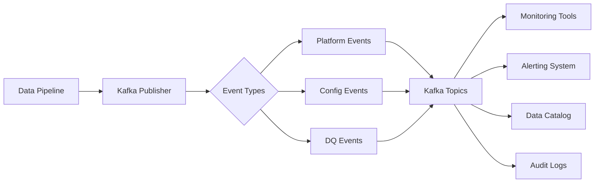
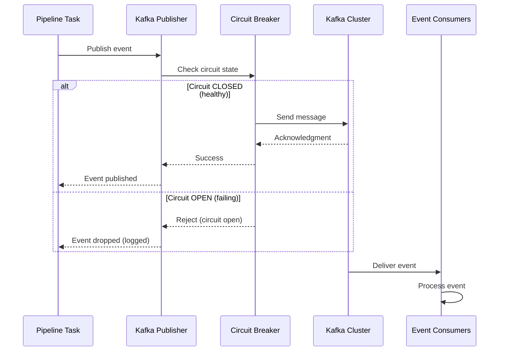
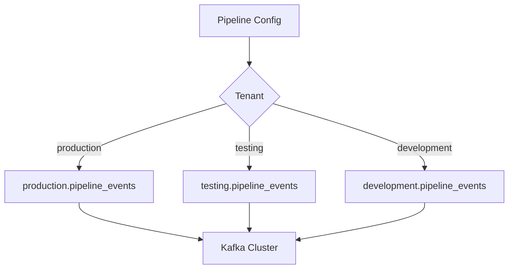
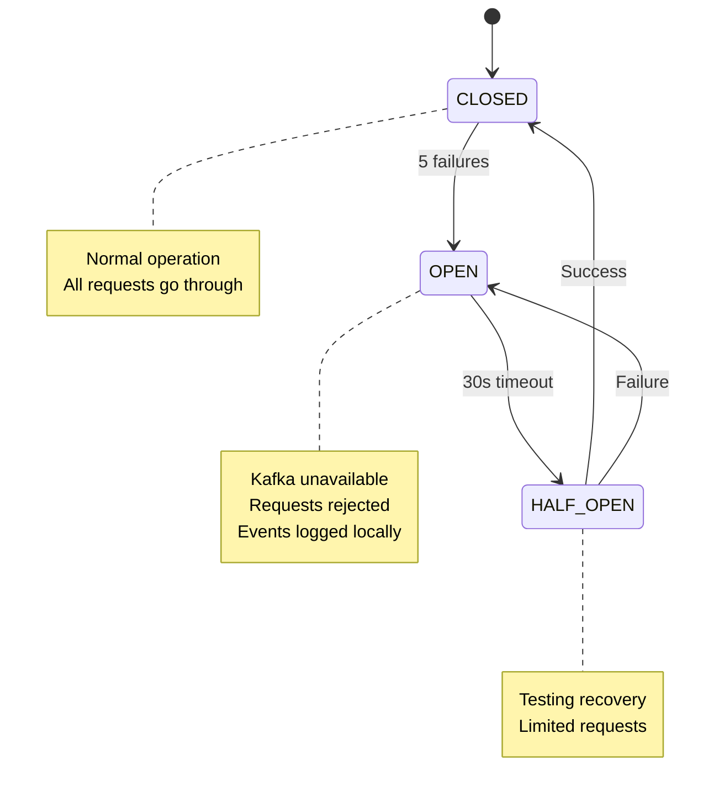

# Kafka Events and Monitoring

## Table of Contents
- [Introduction](#introduction)
- [Event Architecture](#event-architecture)
- [Event Types](#event-types)
  - [Platform Events](#platform-events)
  - [Config-Specific Events](#config-specific-events)
  - [Data Quality Events](#data-quality-events)
- [Event Naming Conventions](#event-naming-conventions)
  - [Namespace Usage](#namespace-usage)
  - [Topic Structure](#topic-structure)
- [Event Schemas](#event-schemas)
- [Kafka Configuration](#kafka-configuration)
- [Circuit Breaker Pattern](#circuit-breaker-pattern)
- [Consuming Events](#consuming-events)
- [Monitoring and Observability](#monitoring-and-observability)
- [Troubleshooting](#troubleshooting)

---

## Introduction

The Configuration Driven Pipeline is **event-driven** at its core. All significant pipeline activities publish structured events to **Apache Kafka**, enabling:

- ✅ **Real-time monitoring** - Track pipeline execution as it happens
- ✅ **Audit trails** - Complete history of all operations
- ✅ **Alerting** - Trigger notifications on failures or SLA misses
- ✅ **Lineage tracking** - Understand data flow across systems
- ✅ **Integration** - Connect with external monitoring tools



---

## Event Architecture

### High-Level Flow



### Publisher Pattern

The platform uses a **singleton Kafka producer** with:
- Thread-safe publishing
- Circuit breaker for resilience
- Automatic retry with exponential backoff
- Graceful degradation (logs locally if Kafka unavailable)

---

## Event Types

### Platform Events

System-level events published automatically by the framework:

| Event Type | When Published | Topic Suffix |
|-----------|---------------|--------------|
| `dag.started` | DAG run begins | `pipeline_events` |
| `dag.completed` | DAG run succeeds | `pipeline_events` |
| `dag.failed` | DAG run fails | `pipeline_events` |
| `task.started` | Task begins execution | `pipeline_events` |
| `task.completed` | Task completes successfully | `pipeline_events` |
| `task.failed` | Task fails | `pipeline_events` |
| `deadline.missed` | SLA deadline missed | `pipeline_alerts` |

**Example Event:**
```json
{
  "event_type": "dag.started",
  "timestamp": "2024-02-04T10:30:00Z",
  "dag_id": "customer_api_sync",
  "run_id": "manual__2024-02-04T10:30:00+00:00",
  "tenant": "production",
  "metadata": {
    "owner": "data-engineering",
    "source": "customer_api"
  }
}
```

### Config-Specific Events

Custom events defined in pipeline configurations:

```yaml
events:
  enabled: true
  publish_to_kafka: true
  
  custom_events:
    - name: high_value_order
      condition: "order_amount > 10000"
      topic: business_events
      payload:
        order_id: "{{ order_id }}"
        amount: "{{ order_amount }}"
        customer: "{{ customer_id }}"
```

### Data Quality Events

Published by the DQ validation engine:

| Event Type | Description | Topic Suffix |
|-----------|-------------|--------------|
| `dq.scan.started` | DQ scan begins | `dq_metrics` |
| `dq.scan.completed` | DQ scan completes | `dq_metrics` |
| `dq.check.passed` | Individual check passes | `dq_metrics` |
| `dq.check.failed` | Individual check fails | `dq_metrics` |
| `dq.quarantine.created` | Records sent to quarantine | `dq_events` |
| `dq.hitl.approval_requested` | HITL approval needed | `dq_events` |

**DQ Event Example:**
```json
{
  "event_type": "dq.scan.completed",
  "timestamp": "2024-02-04T10:35:00Z",
  "scan_id": "uuid-1234",
  "dag_id": "customer_api_sync",
  "source": "customer_api",
  "total_rows": 1000,
  "passed": 950,
  "failed": 50,
  "pass_rate": 0.95,
  "status": "warning",
  "checks": [
    {
      "name": "email_not_null",
      "column": "email",
      "passed": 950,
      "failed": 50,
      "pass_rate": 0.95
    }
  ]
}
```

---

## Event Naming Conventions

### Namespace Usage

All Kafka topics are **namespaced by tenant** to ensure isolation:



**Benefits:**
- ✅ **Isolation** - Teams can't see each other's events
- ✅ **Access Control** - ACLs based on tenant namespace
- ✅ **Organization** - Clear topic ownership

### Topic Structure

```
{tenant}.{namespace}_{event_category}
```

**Components:**
- `tenant` - From `metadata.tenant` in config
- `namespace` - Logical grouping (pipeline, dq, business)
- `event_category` - Event type (events, metrics, alerts)

**Examples:**
```
production.pipeline_events      # Platform events for production tenant
production.dq_metrics           # DQ metrics for production
testing.pipeline_events         # Platform events for testing tenant
production.business_events      # Custom business events
```

### Topic Naming Examples

| Configuration | Resulting Topic |
|--------------|----------------|
| Tenant: `production`, Platform Event | `production.pipeline_events` |
| Tenant: `production`, DQ Metric | `production.dq_metrics` |
| Tenant: `testing`, Platform Event | `testing.pipeline_events` |
| Tenant: `production`, Custom Event | `production.business_events` |

---

## Event Schemas

### Standard Event Envelope

All events follow a common envelope structure:

```json
{
  "event_id": "uuid-5678",
  "event_type": "task.completed",
  "timestamp": "2024-02-04T10:35:00Z",
  "version": "1.0",
  "source": {
    "tenant": "production",
    "dag_id": "customer_api_sync",
    "task_id": "ingest_data",
    "run_id": "manual__2024-02-04T10:30:00+00:00"
  },
  "payload": {
    // Event-specific data
  }
}
```

### DAG Started Event

```json
{
  "event_type": "dag.started",
  "timestamp": "2024-02-04T10:30:00Z",
  "dag_id": "customer_api_sync",
  "run_id": "manual__2024-02-04T10:30:00+00:00",
  "execution_date": "2024-02-03T00:00:00Z",
  "tenant": "production",
  "metadata": {
    "owner": "data-engineering",
    "description": "Daily customer sync",
    "source_type": "rest_api"
  }
}
```

### Task Completed Event

```json
{
  "event_type": "task.completed",
  "timestamp": "2024-02-04T10:35:00Z",
  "dag_id": "customer_api_sync",
  "task_id": "ingest_data",
  "run_id": "manual__2024-02-04T10:30:00+00:00",
  "tenant": "production",
  "duration_seconds": 120,
  "records_processed": 1000,
  "status": "success"
}
```

### DQ Metrics Event

```json
{
  "event_type": "dq.scan.completed",
  "scan_id": "uuid-1234",
  "timestamp": "2024-02-04T10:35:00Z",
  "dag_id": "customer_api_sync",
  "tenant": "production",
  "source": "customer_api",
  "destination_table": "customers.raw_data",
  "metrics": {
    "total_rows": 1000,
    "valid_rows": 950,
    "invalid_rows": 50,
    "pass_rate": 0.95
  },
  "checks": [
    {
      "name": "email_not_null",
      "column": "email",
      "type": "not_null",
      "passed": 950,
      "failed": 50,
      "status": "warning"
    }
  ],
  "quality_gate": {
    "status": "warning",
    "fail_threshold": 0.95,
    "warn_threshold": 0.98
  }
}
```

---

## Kafka Configuration

### Global Settings

Configure Kafka in `global_settings.yaml`:

```yaml
kafka:
  enabled: true
  bootstrap_servers: "kafka:9092"
  security_protocol: "PLAINTEXT"
  
  producer:
    acks: "1"  # Acknowledgment level
    compression_type: "gzip"
    max_request_size: 1048576  # 1MB
    
  timeouts:
    request_timeout_ms: 30000
    socket_timeout_ms: 5000
    message_timeout_ms: 10000
```

### Security Protocols

#### PLAINTEXT (Development)

```yaml
kafka:
  security_protocol: "PLAINTEXT"
  bootstrap_servers: "localhost:9092"
```

#### SASL_SSL (Production)

```yaml
kafka:
  security_protocol: "SASL_SSL"
  bootstrap_servers: "kafka-prod:9093"
  sasl_mechanism: "SCRAM-SHA-256"
  sasl_username: "{{ conn.kafka.login }}"
  sasl_password: "{{ conn.kafka.password }}"
```

### Per-Pipeline Configuration

Override global settings per pipeline:

```yaml
metadata:
  tenant: production

kafka:
  enabled: true
  topic_prefix: custom_namespace  # Override default namespace
  
events:
  publish_ingestion: true
  publish_transformation: true
  publish_dq_metrics: true
```

---

## Circuit Breaker Pattern

### Why Circuit Breaker?

Prevents **cascading failures** when Kafka is unavailable:



### Configuration

```yaml
kafka:
  circuit_breaker:
    failure_threshold: 5
    recovery_timeout: 30  # seconds
    half_open_max_calls: 3
```

### Behavior

| State | Behavior | Recovery |
|-------|----------|----------|
| **CLOSED** | Normal operation | N/A |
| **OPEN** | Reject all requests, log locally | Auto-transition after timeout |
| **HALF_OPEN** | Allow limited test requests | Transition to CLOSED on success |

---

## Consuming Events

### Python Consumer Example

```python
from confluent_kafka import Consumer, KafkaError

# Configure consumer
consumer = Consumer({
    'bootstrap.servers': 'kafka:9092',
    'group.id': 'pipeline_monitor',
    'auto.offset.reset': 'earliest'
})

# Subscribe to topics
consumer.subscribe(['production.pipeline_events'])

# Consume messages
while True:
    msg = consumer.poll(timeout=1.0)
    
    if msg is None:
        continue
    
    if msg.error():
        if msg.error().code() == KafkaError._PARTITION_EOF:
            continue
        else:
            print(f'Error: {msg.error()}')
            break
    
    # Process event
    event = json.loads(msg.value().decode('utf-8'))
    print(f"Event: {event['event_type']} - {event['dag_id']}")
    
    # Commit offset
    consumer.commit(asynchronous=False)

consumer.close()
```

### Filtering Events

Subscribe to specific event patterns:

```python
# All DQ metrics across tenants
consumer.subscribe(['*.dq_metrics'])

# Production events only
consumer.subscribe(['production.*'])

# Specific tenant and category
consumer.subscribe(['production.pipeline_events'])
```

---

## Monitoring and Observability

### Key Metrics to Monitor

| Metric | Source | Use Case |
|--------|--------|----------|
| DAG success rate | `dag.completed` / `dag.failed` | Pipeline health |
| Task duration | `task.completed.duration_seconds` | Performance trends |
| DQ pass rate | `dq.scan.completed.pass_rate` | Data quality trends |
| Quarantine volume | `dq.quarantine.created` | Data quality issues |
| Deadline misses | `deadline.missed` | SLA compliance |

### Dashboard Example (InfluxDB + Grafana)

```sql
-- DAG Success Rate (Last 24 Hours)
SELECT 
    COUNT(*) FILTER (WHERE status = 'success') * 100.0 / COUNT(*) as success_rate
FROM kafka_events
WHERE event_type = 'dag.completed'
  AND timestamp > NOW() - INTERVAL '24 hours'
GROUP BY tenant, dag_id
```

### Alerting Rules

```yaml
# Example: Alert on DQ failures
alerts:
  - name: low_dq_pass_rate
    condition: "event.pass_rate < 0.95"
    source: production.dq_metrics
    action:
      type: email
      recipients: [data-quality@example.com]
      subject: "DQ Pass Rate Below Threshold"
```

---

## Troubleshooting

### Issue: Events Not Being Published

**Check:**
1. Is Kafka enabled?
   ```yaml
   kafka:
     enabled: true
   ```

2. Can the pipeline reach Kafka?
   ```bash
   telnet kafka 9092
   ```

3. Check circuit breaker state:
   ```python
   # In logs
   log.info("Circuit breaker state", state=circuit_breaker.state)
   ```

### Issue: Topic Not Found

**Error:**
```
KafkaError: Topic 'production.pipeline_events' not found
```

**Solution:**
- Enable auto-topic creation in Kafka config:
  ```properties
  auto.create.topics.enable=true
  ```

- Or manually create topic:
  ```bash
  kafka-topics --create \
    --bootstrap-server kafka:9092 \
    --topic production.pipeline_events \
    --partitions 3 \
    --replication-factor 1
  ```

### Issue: High Event Latency

**Symptoms:** Events appear in Kafka minutes after publishing

**Diagnosis:**
- Check producer `linger.ms` setting (batching delay)
- Monitor `request_timeout_ms`
- Verify Kafka broker health

**Solution:**
```yaml
kafka:
  producer:
    linger_ms: 0  # Send immediately
    batch_size: 16384
```

### Issue: Circuit Breaker Stuck OPEN

**Symptoms:** Events not publishing, circuit breaker logs show OPEN state

**Solution:**
1. Fix Kafka connectivity
2. Wait for recovery timeout (default 30s)
3. Circuit breaker will auto-transition to HALF_OPEN
4. Successful test will transition to CLOSED

---

## Next Steps

- **[Data Sinks](08_Data_Sinks.md)** - Configure data destinations
- **[Developer Guide](09_Developer_Guide.md)** - Test Kafka integration locally
- **[Overview](01_Overview.md)** - Review overall architecture

---

**Events are the Heartbeat of Your Pipeline!** Monitor them closely for insights and early warning of issues.
