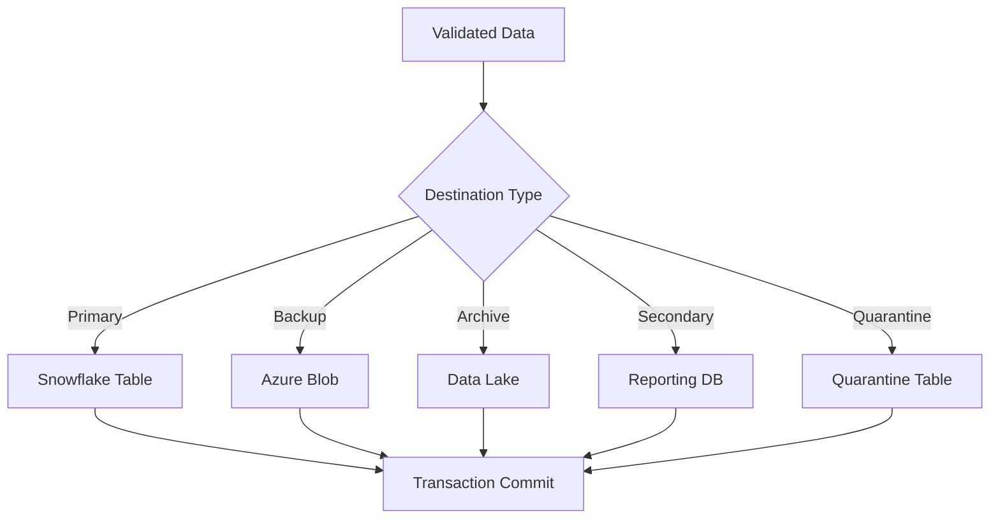
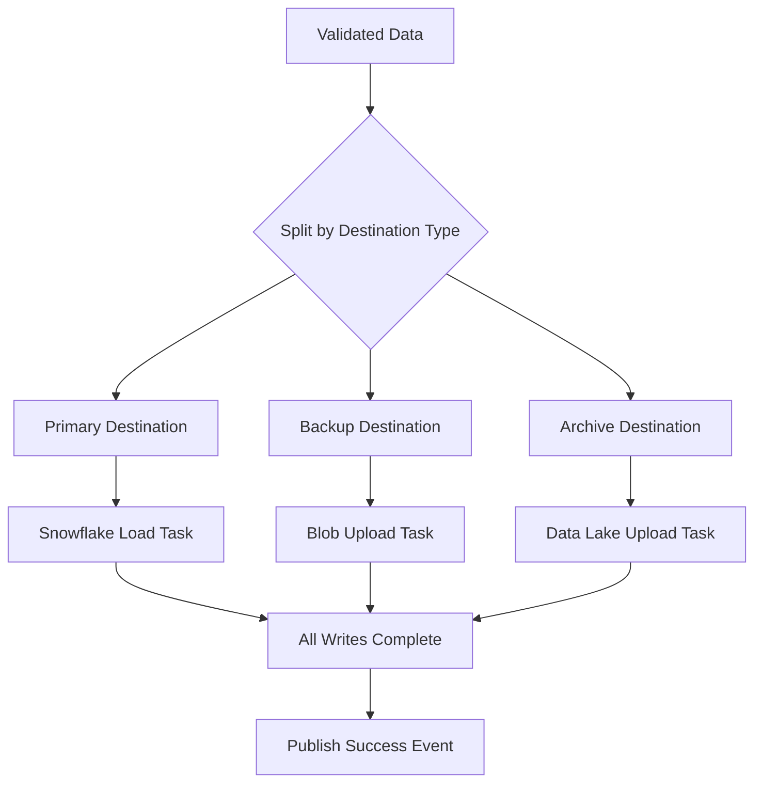
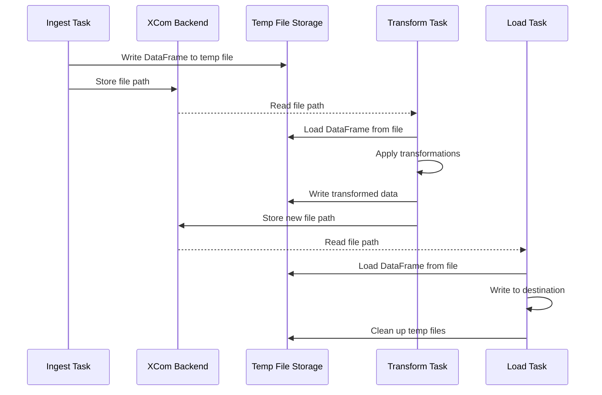
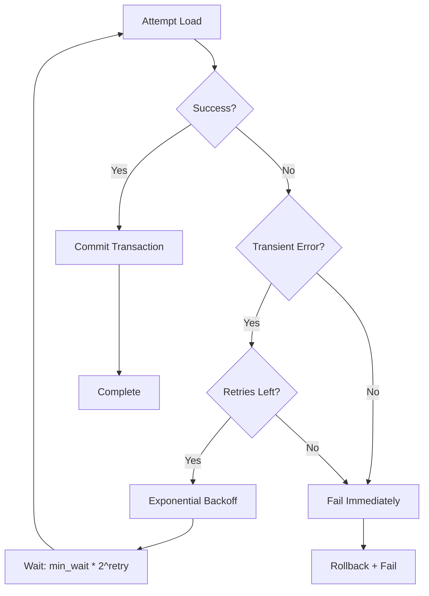

# Data Sinks and Destinations

## Table of Contents
- [Introduction](#introduction)
- [Destination Types](#destination-types)
- [Snowflake](#snowflake)
  - [Connection Configuration](#connection-configuration)
  - [Loading Strategies](#loading-strategies)
  - [Stored Procedures](#stored-procedures)
- [Azure Blob Storage](#azure-blob-storage)
- [Azure Data Lake](#azure-data-lake)
- [Local File System](#local-file-system)
- [Multiple Destinations](#multiple-destinations)
- [XCom and Temporary Storage](#xcom-and-temporary-storage)
- [Retry and Error Handling](#retry-and-error-handling)
- [Complete Examples](#complete-examples)
- [Best Practices](#best-practices)
- [Troubleshooting](#troubleshooting)

---

## Introduction

The Configuration Driven Pipeline supports **multiple data sink types** for maximum flexibility. Data can be loaded to:

- ✅ **Snowflake** - Tables, stages, and stored procedures
- ✅ **Azure Blob Storage** - Cloud object storage
- ✅ **Azure Data Lake** - Hierarchical data lake storage
- ✅ **Local Files** - For development and testing
- ✅ **Print/Logs** - For debugging



---

## Destination Types

Pipelines can define **multiple destinations** for different purposes:

| Type | Purpose | Example Use Case |
|------|---------|------------------|
| **Primary** | Main destination (required) | Production Snowflake table |
| **Backup** | Redundant copy for disaster recovery | Azure Blob backup container |
| **Archive** | Long-term storage (compressed) | Data Lake archive partition |
| **Secondary** | Additional processing destination | Reporting database |
| **Summary** | Aggregated/summarized data | Summary statistics table |
| **Quarantine** | Invalid records from DQ checks | Quarantine table with HITL |

### Configuration Structure

```yaml
destination:
  primary:
    type: snowflake
    table: customers.raw_data
  
  backup:
    type: azure_blob
    container: backups
    path: customers/{{ ds }}
  
  archive:
    type: azure_data_lake
    path: archive/customers/{{ ds }}
  
  quarantine:
    type: snowflake
    table: customers.quarantine
```

---

## Snowflake

### Connection Configuration

#### Using Airflow Connections

```yaml
destination:
  primary:
    type: snowflake
    connection_id: snowflake_default  # Resolved with tenant prefix
    database: PROD_DB
    schema: raw_data
    table: customers
```

**Tenant-Aware Resolution:**
```
Tenant: production → Connection: prod_snowflake_default
Tenant: testing → Connection: test_snowflake_default
```

#### Create Snowflake Connection

```bash
# Production connection
airflow connections add prod_snowflake_default \
  --conn-type snowflake \
  --login analytics_user \
  --password 'secure-password' \
  --schema PUBLIC \
  --extra '{
    "account": "myorg-myaccount",
    "warehouse": "ANALYTICS_WH",
    "database": "PROD_DB",
    "region": "us-east-1"
  }'
```

### Loading Strategies

#### Append Mode (Default)

Add new rows to existing table:

```yaml
destination:
  primary:
    type: snowflake
    table: orders.transactions
    load_mode: append
```

**Behavior:**
- Inserts all records
- Does not check for duplicates
- Fast performance
- Use for streaming/incremental loads

#### Truncate and Load

Replace all existing data:

```yaml
destination:
  primary:
    type: snowflake
    table: orders.daily_summary
    load_mode: truncate
```

**Behavior:**
- Truncates table first
- Then inserts all records
- Use for full refresh scenarios

#### Merge/Upsert

Update existing rows, insert new ones:

```yaml
destination:
  primary:
    type: snowflake
    table: customers.master
    load_mode: merge
    merge_key: customer_id
    update_columns:
      - email
      - phone
      - updated_at
```

**Behavior:**
- Matches on `merge_key`
- Updates `update_columns` if match found
- Inserts new records if no match
- Use for maintaining slowly changing dimensions

**Generated SQL:**
```sql
MERGE INTO customers.master AS target
USING staging_table AS source
ON target.customer_id = source.customer_id
WHEN MATCHED THEN
  UPDATE SET 
    email = source.email,
    phone = source.phone,
    updated_at = source.updated_at
WHEN NOT MATCHED THEN
  INSERT (customer_id, email, phone, updated_at)
  VALUES (source.customer_id, source.email, source.phone, source.updated_at)
```

### Table Creation

Auto-create tables if they don't exist:

```yaml
destination:
  primary:
    type: snowflake
    table: new_table.data
    create_if_not_exists: true
    schema_inference: true  # Infer from DataFrame
```

**Example Schema Inference:**
```python
# DataFrame columns automatically map to Snowflake types:
customer_id (int64) → NUMBER
name (string) → VARCHAR
amount (float64) → FLOAT
created_at (datetime64) → TIMESTAMP_NTZ
```

### Stored Procedures

Execute Snowflake stored procedures after loading:

```yaml
destination:
  primary:
    type: snowflake
    table: orders.raw_data
    
  post_processing:
    - type: stored_procedure
      name: analytics.sp_process_orders
      parameters:
        - "{{ ds }}"
        - "{{ dag_run.run_id }}"
```

**Stored Procedure Example:**
```sql
CREATE OR REPLACE PROCEDURE analytics.sp_process_orders(
    p_date VARCHAR,
    p_run_id VARCHAR
)
RETURNS VARCHAR
LANGUAGE SQL
AS
$$
BEGIN
    -- Business logic here
    INSERT INTO orders.processed
    SELECT * FROM orders.raw_data
    WHERE DATE(created_at) = p_date;
    
    RETURN 'Processed successfully';
END;
$$
```

---

## Azure Blob Storage

### Configuration

```yaml
destination:
  primary:
    type: azure_blob
    connection_id: azure_storage  # Azure Storage connection
    container: data-exports
    path: customers/{{ ds }}/export.parquet
    format: parquet
    compression: gzip
```

### File Formats

#### Parquet (Recommended for Analytics)

```yaml
destination:
  primary:
    type: azure_blob
    container: analytics-data
    path: customers/{{ ds }}/data.parquet
    format: parquet
    compression: snappy
```

**Benefits:**
- ✅ Columnar format (fast queries)
- ✅ Built-in compression
- ✅ Schema embedded
- ✅ Efficient for large datasets

#### CSV

```yaml
destination:
  primary:
    type: azure_blob
    container: exports
    path: customers/{{ ds }}/export.csv
    format: csv
    options:
      delimiter: ","
      header: true
      encoding: utf-8
```

#### JSON

```yaml
destination:
  primary:
    type: azure_blob
    container: json-exports
    path: customers/{{ ds }}/data.json
    format: json
    options:
      orient: records
      lines: true  # JSONL format
```

### Connection Setup

```bash
# Create Azure Blob connection
airflow connections add azure_storage \
  --conn-type azure_blob_storage \
  --extra '{
    "connection_string": "DefaultEndpointsProtocol=https;AccountName=myaccount;AccountKey=...",
    "container_name": "default-container"
  }'
```

---

## Azure Data Lake

### Configuration

```yaml
destination:
  primary:
    type: azure_data_lake
    connection_id: azure_datalake
    path: /raw/customers/{{ ds }}/data.parquet
    format: parquet
    partition_by:
      - year
      - month
```

### Partitioning

Organize data by columns for efficient querying:

```yaml
destination:
  primary:
    type: azure_data_lake
    path: /analytics/sales/
    format: parquet
    partition_by:
      - order_year
      - order_month
      - region
```

**Resulting Structure:**
```
/analytics/sales/
  order_year=2024/
    order_month=01/
      region=US/
        data.parquet
      region=EU/
        data.parquet
    order_month=02/
      ...
```

**Benefits:**
- ✅ Faster queries (partition pruning)
- ✅ Organized data structure
- ✅ Easier data management

---

## Local File System

For development and testing:

```yaml
destination:
  type: local_file
  path: /tmp/airflow_output/{{ dag_id }}/{{ ds }}.json
  format: json
```

**Use Cases:**
- Development on local machine
- Testing pipeline logic
- Debugging transformations

---

## Multiple Destinations

### Parallel Writes

Write to multiple destinations simultaneously:

```yaml
destination:
  primary:
    type: snowflake
    database: PROD_DB
    schema: raw_data
    table: customers
  
  backup:
    type: azure_blob
    container: backups
    path: customers/{{ ds }}/backup.parquet
  
  archive:
    type: azure_data_lake
    path: /archive/customers/year={{ execution_date.year }}/month={{ execution_date.month }}/
    format: parquet
    compression: gzip
```

### Write Flow



---

## XCom and Temporary Storage

### How Data Moves Between Tasks



### Temporary File Management

**Automatic Cleanup:**
- Temp files created in `/tmp/airflow_data/<dag_id>/<run_id>/`
- Automatically cleaned after task completion
- Configurable retention period

**Configuration:**
```yaml
# In global_settings.yaml
temp_storage:
  path: /tmp/airflow_data
  cleanup: true
  retention_hours: 24
```

---

## Retry and Error Handling

### Transactional Loading

Snowflake loads are **transactional** with automatic retry:

```yaml
destination:
  primary:
    type: snowflake
    table: orders.transactions
    retry_attempts: 3
    retry_min_wait: 4
    retry_max_wait: 10
```

### Retry Strategy



**Transient Errors (Retried):**
- Connection timeouts
- Network errors
- `OperationalError`
- `DatabaseError`

**Permanent Errors (Not Retried):**
- SQL syntax errors
- Permission denied
- Table not found
- Schema mismatch

---

## Complete Examples

### Example 1: Multi-Destination Pipeline

```yaml
name: customer_data_pipeline
description: Load customer data with backup and archive

metadata:
  tenant: production
  owner: data-engineering

data_source:
  type: rest_api
  endpoint: https://api.example.com/customers

transformations:
  - type: add_column
    column_name: processed_at
    formula: "NOW()"

data_quality_checks:
  enabled: true
  rules:
    - name: email_not_null
      column: email
      type: not_null

destination:
  primary:
    type: snowflake
    database: PROD_DB
    schema: raw_data
    table: customers
    load_mode: merge
    merge_key: customer_id
    create_if_not_exists: true
  
  backup:
    type: azure_blob
    container: customer-backups
    path: "backups/{{ ds }}/customers.parquet"
    format: parquet
    compression: snappy
  
  archive:
    type: azure_data_lake
    path: "/archive/customers/year={{ execution_date.year }}/month={{ execution_date.month }}/"
    format: parquet
    partition_by:
      - country
      - state
  
  quarantine:
    type: snowflake
    database: PROD_DB
    schema: quarantine
    table: customer_quarantine
    hitl:
      enabled: true
```

### Example 2: Snowflake with Post-Processing

```yaml
destination:
  primary:
    type: snowflake
    database: ANALYTICS_DB
    schema: staging
    table: order_staging
    load_mode: truncate
  
  post_processing:
    - type: stored_procedure
      name: analytics.sp_aggregate_orders
      parameters:
        - "{{ ds }}"
        - "{{ task_instance.run_id }}"
    
    - type: stored_procedure
      name: analytics.sp_update_kpis
      parameters:
        - "{{ ds }}"
```

### Example 3: Partitioned Data Lake Storage

```yaml
destination:
  primary:
    type: azure_data_lake
    path: /analytics/sales/
    format: parquet
    compression: gzip
    
    partition_by:
      - order_year
      - order_month
      - region
    
    options:
      row_group_size: 100000
      use_dictionary: true
```

---

## Best Practices

### ✅ DO

1. **Use Parquet for analytics workloads**
   ```yaml
   format: parquet
   compression: snappy
   ```

2. **Enable auto-create for new tables**
   ```yaml
   create_if_not_exists: true
   ```

3. **Use merge mode for slowly changing dimensions**
   ```yaml
   load_mode: merge
   merge_key: id
   ```

4. **Partition large datasets**
   ```yaml
   partition_by:
     - year
     - month
   ```

5. **Configure backup destinations for critical data**
   ```yaml
   backup:
     type: azure_blob
     container: critical-backups
   ```

### ❌ DON'T

1. **Don't use append mode without deduplication**
   ```yaml
   # ❌ Can create duplicates
   load_mode: append
   
   # ✅ Better
   load_mode: merge
   merge_key: unique_id
   ```

2. **Don't skip schema validation**
   ```yaml
   # ❌ BAD
   validate_schema: false
   
   # ✅ GOOD
   validate_schema: true
   ```

3. **Don't hardcode paths without templates**
   ```yaml
   # ❌ BAD
   path: /data/export.csv
   
   # ✅ GOOD
   path: /data/{{ ds }}/export.csv
   ```

---

## Troubleshooting

### Issue: Snowflake Connection Timeout

**Error:**
```
OperationalError: Connection timeout
```

**Solutions:**
1. Check Snowflake warehouse status
2. Verify network connectivity
3. Increase timeout:
   ```yaml
   destination:
     timeout: 120  # seconds
   ```

### Issue: Azure Blob Permission Denied

**Error:**
```
AzureException: 403 Forbidden
```

**Check:**
1. Storage account key is correct
2. Container exists
3. Connection has write permissions

### Issue: Schema Mismatch

**Error:**
```
SchemaError: Column 'email' not found in target table
```

**Solutions:**
1. Enable auto-create:
   ```yaml
   create_if_not_exists: true
   ```

2. Or match DataFrame schema to table schema

### Issue: Merge Key Not Unique

**Error:**
```
DataError: Merge key 'customer_id' contains duplicates
```

**Solution:**
- Deduplicate before merge:
  ```yaml
  transformations:
    - type: deduplicate
      key: customer_id
      keep: last
  ```

---

## Next Steps

- **[Developer Guide](09_Developer_Guide.md)** - Test destinations locally
- **[Kafka Events](07_Kafka_Events.md)** - Monitor load completion events
- **[Data Quality](05_Data_Quality_And_Validation.md)** - Validate before loading

---

**Choose the Right Sink for the Job!** Consider performance, cost, and use case when selecting destinations.
