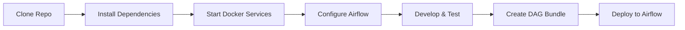
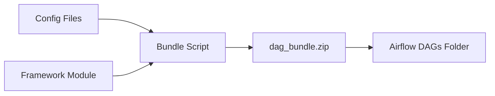

# Developer Guide

## Table of Contents
- [Introduction](#introduction)
- [Development Environment Setup](#development-environment-setup)
  - [Prerequisites](#prerequisites)
  - [Installation Steps](#installation-steps)
  - [Docker Compose Setup](#docker-compose-setup)
- [Project Structure](#project-structure)
- [Local Development Workflow](#local-development-workflow)
- [Testing](#testing)
  - [Unit Tests](#unit-tests)
  - [Integration Tests](#integration-tests)
  - [End-to-End Tests](#end-to-end-tests)
  - [Contract Tests](#contract-tests)
- [Module Management](#module-management)
- [DAG Bundle Deployment](#dag-bundle-deployment)
- [Docker and BuildKit](#docker-and-buildkit)
- [Environment Configuration](#environment-configuration)
- [Debugging](#debugging)
- [Contributing Guidelines](#contributing-guidelines)

---

## Introduction

This guide helps developers:

- ✅ Set up a **local development environment**
- ✅ Understand the **project structure**
- ✅ Write and run **tests**
- ✅ Deploy **DAG bundles**
- ✅ Debug **pipeline issues**
- ✅ Contribute **code changes**



---

## Development Environment Setup

### Prerequisites

Before you begin, ensure you have:

| Tool | Version | Purpose |
|------|---------|---------|
| **Windows 10/11** | 2004+ (Build 19041+) | Operating system |
| **WSL 2** | Latest | Linux subsystem for Docker |
| **Docker Desktop** | 24.x+ | Container runtime |
| **Python** | 3.12 | Programming language |
| **Git** | Latest | Version control |
| **VS Code** | Latest | IDE (recommended) |

### Installation Steps

#### 1. Setup WSL 2

```powershell
# Open PowerShell as Administrator
wsl --install

# Install Ubuntu 22.04
wsl --install -d Ubuntu-22.04

# Verify installation
wsl -l -v
```

#### 2. Install Docker Desktop

```TXT
Request installation from RLAM IT Service Portal.
```

#### 3. Configure File Sharing

Add your project directory to Docker Desktop:
- Go to **Settings > Resources > File Sharing**
- Click **+** and add your workspace path
- Click **Apply & Restart**

#### 4. Install Python 3.12

```TXT
Request installation from RLAM IT Service Portal.
```

Verify installation:
```powershell
python --version
# Output: Python 3.12.x
```

#### 5. Install VS Code

```TXT
Request installation from RLAM IT Service Portal.
```

**Recommended Extensions:**
- Python
- Docker
- Apache Airflow
- YAML

#### 6. Install Git

```TXT
Request installation from RLAM IT Service Portal.
```

### Clone Repository

```bash
# HTTPS
git clone https://github.com/prajayrajsinghrathore/ConfigDrivenDataPipeline.git

# SSH (if configured)
git clone git@github.com:prajayrajsinghrathore/ConfigDrivenDataPipeline.git

# Navigate to repo
cd ConfigDrivenDataPipeline

# Switch to develop branch
git checkout develop
```

### Install Python Dependencies

```powershell
# Create virtual environment (optional but recommended)
python -m venv venv

# Activate virtual environment
# On Windows PowerShell:
.\venv\Scripts\Activate.ps1

# Install requirements
pip install -r requirements.txt
```

**This will install:**
- Apache Airflow 3.1.6
- Pandas, NumPy
- Soda Core
- Pytest
- And all other dependencies

---

## Docker Compose Setup

### Start Local Airflow

```bash
# Navigate to docker directory
cd docker

# Start all services
docker-compose up -d
```

**Services Started:**
- **Airflow Webserver** - `localhost:8080`
- **Airflow Scheduler** - Background service
- **PostgreSQL** - Airflow metadata database
- **Kafka** - Event streaming (optional)
- **Zookeeper** - Kafka coordinator (if Kafka enabled)

### Access Airflow UI

1. Open browser: http://localhost:8080
2. Login credentials:
   - **Username**: `airflow`
   - **Password**: `airflow`

### Verify Services

```bash
# Check running containers
docker-compose ps

# View logs
docker-compose logs -f airflow-webserver

# Check Airflow version
docker-compose exec airflow-webserver airflow version
```

### Stop Services

```bash
# Stop all services
docker-compose down

# Stop and remove volumes (clean slate)
docker-compose down -v
```

---

## Project Structure

```
ConfigDrivenDataPipeline/
├── config/                          # Configuration files
│   ├── global_settings.yaml        # Global defaults
│   ├── validation_config.yaml      # DQ validation rules
│   ├── data_sources/               # Pipeline configs
│   │   ├── joke_api_test.yaml
│   │   └── simple_test.yaml
│   └── schemas/                    # Schema definitions
│       ├── data_source_schema.yaml
│       ├── transformation_schema.yaml
│       └── enrichment_schema.yaml
│
├── dags/                           # Airflow DAGs
│   ├── __init__.py
│   └── generate_dags.py           # DAG generator
│
├── rlam_airflow_framework/        # Core framework (packaged)
│   ├── __init__.py
│   ├── config_loader.py           # Config loading & validation
│   ├── dag_factory_v2.py          # DAG factory
│   ├── data_fetchers.py           # HTTP/SFTP fetchers
│   ├── data_loaders.py            # Snowflake/Azure loaders
│   ├── data_quality.py            # Soda Core integration
│   ├── data_transformers.py       # Transformation engine
│   ├── formula_engine.py          # Formula evaluation
│   ├── kafka_publisher.py         # Kafka event publishing
│   ├── serializers.py             # XCom serialization
│   ├── taskflow_tasks.py          # TaskFlow tasks
│   └── tenant_context.py          # Multi-tenancy support
│
├── tests/                          # Test suite
│   ├── unit/                       # Unit tests
│   ├── integration/                # Integration tests
│   ├── contract/                   # Contract tests
│   ├── e2e/                        # End-to-end tests
│   └── conftest.py                 # Pytest fixtures
│
├── plugins/                        # Airflow plugins
│   └── deadline_callbacks.py      # Deadline alert callbacks
│
├── docker/                         # Docker configuration
│   ├── docker-compose.yaml        # Main compose file
│   ├── docker-compose.bundle-test.yaml
│   ├── airflow.cfg                # Airflow configuration
│   └── kowl-config.yaml           # Kafka UI config
│
├── Documentation/                  # User guides (you are here!)
│   ├── 01_Overview.md
│   ├── 02_Configuration_Schemas.md
│   ├── ...
│   └── 09_Developer_Guide.md
│
├── helm/                           # Kubernetes deployment
│   ├── Chart.yaml
│   └── values/
│
├── Dockerfile                      # Container image definition
├── pyproject.toml                  # Python project config
├── pytest.ini                      # Pytest configuration
├── requirements.txt                # Python dependencies
└── README.md                       # Project README
```

---

## Local Development Workflow

### 1. Create a New Pipeline

```powershell
# Create config file
echo. > config/data_sources/my_new_pipeline.yaml
```

**Example Config:**
```yaml
name: my_new_pipeline
description: My test pipeline

metadata:
  tenant: testing
  owner: my-name

schedule:
  interval: "@daily"
  start_date: "2024-01-01"
  catchup: false

data_source:
  type: rest_api
  endpoint: https://api.example.com/data
  method: GET

destination:
  type: local_file
  path: /tmp/airflow_output/my_data.json
```

### 2. Validate Configuration

```python
# In Python REPL or script
from rlam_airflow_framework.config_loader import ConfigLoader

loader = ConfigLoader()
config = loader.load_config('config/data_sources/my_new_pipeline.yaml')
print("Config valid!")
```

### 3. Test DAG Generation

```powershell
# Restart Airflow scheduler to pick up new DAG
docker-compose restart airflow-scheduler

# Check Airflow UI for new DAG
# Navigate to: http://localhost:8080
```

### 4. Trigger DAG Manually

In Airflow UI:
1. Find your DAG: `testing_my_new_pipeline`
2. Toggle **ON**
3. Click **▶ Trigger DAG**

### 5. Monitor Execution

- View logs in Airflow UI
- Check task status
- Inspect XCom values

---

## Testing

### Unit Tests

Test individual functions and classes:

```bash
# Run all unit tests
pytest tests/unit/ -v

# Run specific test file
pytest tests/unit/test_formula_engine.py -v

# Run with coverage
pytest tests/unit/ --cov=rlam_airflow_framework --cov-report=html
```

**Example Unit Test:**
```python
# tests/unit/test_formula_engine.py
from rlam_airflow_framework.formula_engine import FormulaEngine

def test_formula_evaluation():
    engine = FormulaEngine()
    result = engine.evaluate("price * quantity", {
        "price": 10.0,
        "quantity": 5
    })
    assert result == 50.0
```

### Integration Tests

Test interactions between components:

```bash
# Run integration tests
pytest tests/integration/ -v

# Test database integration
pytest tests/integration/test_database_integration.py -v
```

**Example Integration Test:**
```python
# tests/integration/test_kafka_integration.py
def test_kafka_publish(kafka_producer):
    """Test Kafka event publishing."""
    event = {
        "event_type": "test.event",
        "data": {"key": "value"}
    }
    
    kafka_producer.publish(topic="test_topic", event=event)
    # Assert event was published
```

### End-to-End Tests

Test complete pipeline execution:

```bash
# Run E2E tests
pytest tests/e2e/ -v

# Run specific pipeline test
pytest tests/e2e/test_pipeline_e2e.py::test_simple_pipeline -v
```

**Example E2E Test:**
```python
# tests/e2e/test_pipeline_e2e.py
def test_simple_pipeline(airflow_dag_bag):
    """Test full pipeline execution."""
    dag = airflow_dag_bag.get_dag('testing_simple_test')
    
    # Trigger DAG run
    dag.test()
    
    # Assert tasks completed
    assert all(task.state == 'success' for task in dag.tasks)
```

### Contract Tests

Test configuration schema contracts:

```bash
# Run contract tests
pytest tests/contract/ -v
```

**Example Contract Test:**
```python
# tests/contract/test_config_schemas.py
def test_data_source_schema_validation():
    """Test data source schema enforces required fields."""
    config = {
        "name": "test",
        # Missing required fields
    }
    
    with pytest.raises(ValidationError):
        validate_schema(config, 'data_source_schema.yaml')
```

### Running All Tests

```bash
# Run entire test suite
pytest

# With coverage report
pytest --cov=rlam_airflow_framework --cov-report=html

# Open coverage report
# Open htmlcov/index.html in browser
```

---

## Module Management

### Package Structure

The `rlam_airflow_framework` is packaged as a Python module:

```bash
# Build package
python -m build

# Install locally in editable mode
pip install -e .
```

### Import Framework Modules

```python
from rlam_airflow_framework.config_loader import ConfigLoader
from rlam_airflow_framework.dag_factory_v2 import DAGFactoryV2
from rlam_airflow_framework.formula_engine import FormulaEngine
from rlam_airflow_framework.data_quality import DataQualityChecker
```

---

## DAG Bundle Deployment

### What is a DAG Bundle?

A **DAG bundle** packages configuration files and the framework module for deployment to Airflow.



### Create DAG Bundle

```bash
# Run bundle script
python scripts/create_dag_bundle.py

# Output: dag_bundle.zip
```

**Bundle Contents:**
```
dag_bundle.zip
├── config/
│   ├── global_settings.yaml
│   └── data_sources/
├── dags/
│   └── generate_dags.py
└── rlam_airflow_framework/
    ├── __init__.py
    ├── dag_factory_v2.py
    └── ...
```

### Deploy to Airflow

```bash
# Copy to Airflow DAGs folder
cp dag_bundle.zip /path/to/airflow/dags/

# Airflow will auto-extract and load DAGs
```

---

## Docker and BuildKit

### Dockerfile

The project uses **Docker BuildKit** for optimized image builds:

```dockerfile
# syntax=docker/dockerfile:1.4
FROM apache/airflow:3.1.6-python3.12

# Enable BuildKit caching
RUN --mount=type=cache,target=/root/.cache/pip \
    pip install -r requirements.txt

# Copy framework
COPY rlam_airflow_framework /opt/airflow/rlam_airflow_framework
```

**BuildKit Benefits:**
- ✅ **Faster builds** - Caches pip downloads
- ✅ **Smaller images** - Efficient layering
- ✅ **Parallel builds** - Concurrent layer builds

### Build Image

```bash
# Enable BuildKit
export DOCKER_BUILDKIT=1

# Build image
docker build -t config-driven-pipeline:latest .

# Build with cache mount
docker build \
  --build-arg BUILDKIT_INLINE_CACHE=1 \
  -t config-driven-pipeline:latest .
```

### Resource Limitations in Docker Compose

```yaml
# docker-compose.yaml
services:
  airflow-webserver:
    deploy:
      resources:
        limits:
          cpus: '2.0'
          memory: 4G
        reservations:
          cpus: '1.0'
          memory: 2G
```

| Service | CPU Limit | Memory Limit | Use Case |
|---------|-----------|--------------|----------|
| Webserver | 2.0 | 4 GB | UI and API |
| Scheduler | 2.0 | 4 GB | Task scheduling |
| Worker | 4.0 | 8 GB | Task execution |

---

## Environment Configuration

### .env File

Create `.env` file for local development:

```bash
# .env (in docker/ directory)
AIRFLOW_UID=50000
AIRFLOW_GID=0

# Airflow config
AIRFLOW__CORE__EXECUTOR=LocalExecutor
AIRFLOW__CORE__LOAD_EXAMPLES=False

# Database
POSTGRES_USER=airflow
POSTGRES_PASSWORD=airflow
POSTGRES_DB=airflow

# Kafka
KAFKA_ENABLED=false
KAFKA_BOOTSTRAP_SERVERS=kafka:9092

# Python
PYTHONUNBUFFERED=1
```

### Environment Variables

Override settings via environment variables:

```bash
# Timeout configuration
export TIMEOUT_HTTP_REQUEST=60
export TIMEOUT_SFTP_CONNECT=30
export FORMULA_MAX_LENGTH=20480

# Run Airflow
docker-compose up -d
```

---

## Debugging

### View Logs

```bash
# Airflow scheduler logs
docker-compose logs -f airflow-scheduler

# Webserver logs
docker-compose logs -f airflow-webserver

# All services
docker-compose logs -f
```

### Access Container Shell

```bash
# Enter scheduler container
docker-compose exec airflow-scheduler bash

# Run Airflow CLI
airflow dags list
airflow tasks test <dag_id> <task_id> <execution_date>
```

### Debug DAG

```python
# In dags/generate_dags.py, add:
import logging
logging.basicConfig(level=logging.DEBUG)

# Add debug statements
logger = logging.getLogger(__name__)
logger.debug(f"Loading config: {config_file}")
```

### Test Single Task

```bash
# Test a specific task without dependencies
airflow tasks test \
  testing_joke_api_test \
  ingest_data \
  2024-02-04
```

---

## Contributing Guidelines

### Branch Strategy

```bash
# Create feature branch
git checkout -b feature/my-new-feature

# Make changes
# ...

# Commit with descriptive message
git commit -m "feat: add new transformation function"

# Push to remote
git push origin feature/my-new-feature

# Create Pull Request on GitHub
```

### Commit Message Format

Follow [Conventional Commits](https://www.conventionalcommits.org/):

```
<type>(<scope>): <description>

[optional body]

[optional footer]
```

**Types:**
- `feat:` - New feature
- `fix:` - Bug fix
- `docs:` - Documentation
- `test:` - Tests
- `refactor:` - Code refactoring
- `chore:` - Maintenance

**Examples:**
```
feat(formula): add date_diff function
fix(kafka): handle circuit breaker timeout
docs(api): update REST API authentication guide
test(dq): add unit tests for quarantine routing
```

### Code Quality

```bash
# Run linter
flake8 rlam_airflow_framework/

# Run type checker
mypy rlam_airflow_framework/

# Format code
black rlam_airflow_framework/
```

### Pull Request Checklist

- [ ] Tests pass (`pytest`)
- [ ] Code is formatted (`black`)
- [ ] Linter passes (`flake8`)
- [ ] Documentation updated
- [ ] Changelog updated
- [ ] Commit messages follow convention

---

## Next Steps

- **[Overview](01_Overview.md)** - Understand platform architecture
- **[Configuration Schemas](02_Configuration_Schemas.md)** - Learn configuration structure
- **[Data Sources](03_Data_Sources.md)** - Configure data sources

---

**Happy Coding!** 🚀 Reach out to the RLAM Dev team if you need help.
